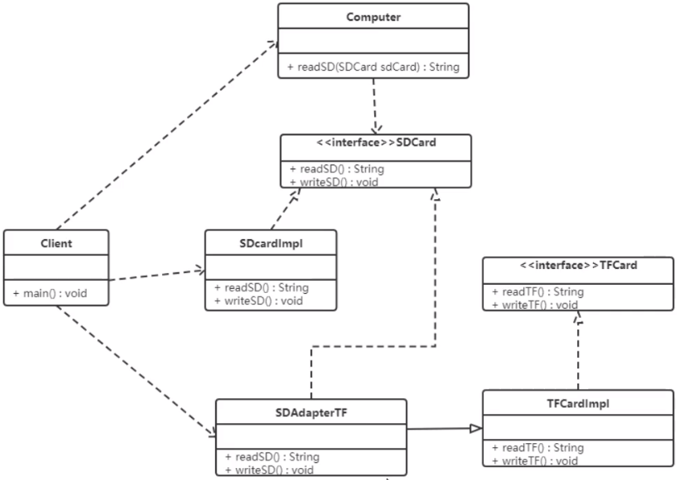
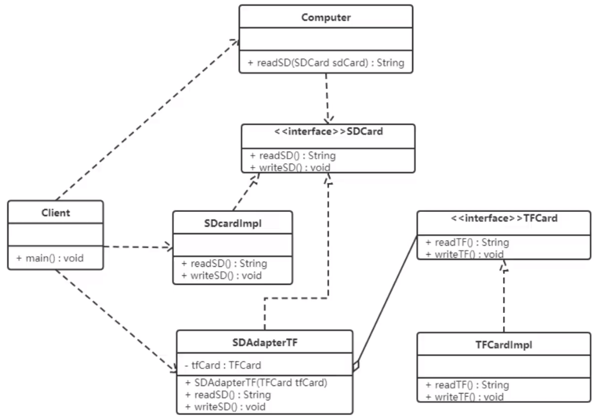
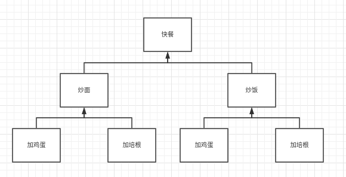
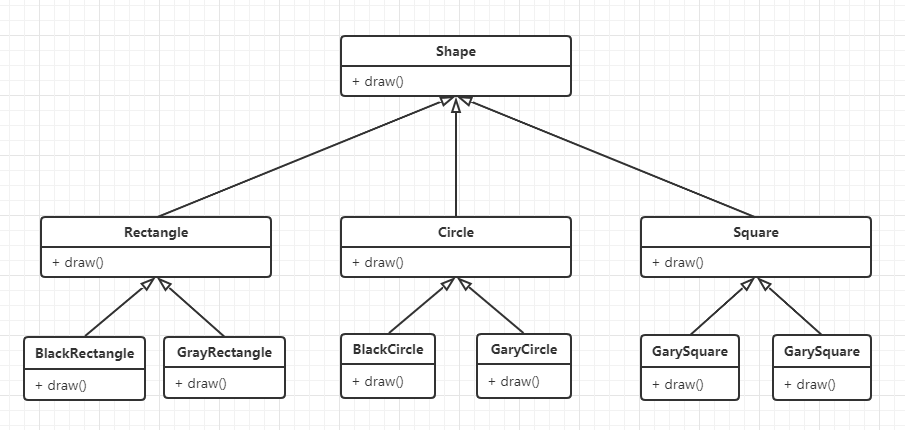
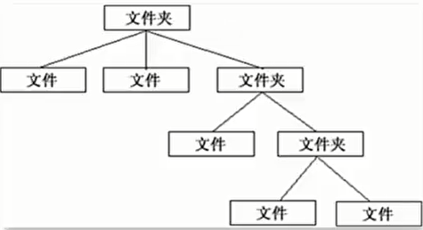

## 结构型模式

结构型模式强调的是结构，如何将对象或者类按照某种更大的布局组成更大的结构。它分为类结构型模式和对象结构型模式，前者采用继承机制来组织接口和类，后者采用组合/聚合来组合对象。

由于组合/聚合关系的耦合度比继承关系的耦合度低，满足合成复用原则，所以对象结构型模式比类结构型模式有更大的灵活性。

结构型模式分为以下七种：

- 代理模式。
- 适配器模式。
- 装饰者模式。
- 桥接模式。
- 外观模式。
- 组合模式。
- 享元模式。

## 代理模式

如果我们想要买房的话，找的是中介而不是房产公司。假如我们想要买电脑，找的是地方代理商而不是具体公司。

所以这就是代理模式，通过一个代理来实现最终的目标，代理模式是一样，访问对象不能直接引用目标对象，而是通过一个中介来访问对应的目标对象。

Java 中的代理按照代理生成的时机不同又分为静态代理和动态代理。静态代理在编译期就已经生成，动态代理则是在 Java 运行时动态生成。动态代理又分为 JDK 代理和 CGLib 代理。

- 静态代理：编译期生成代理对象。
- 动态代理：Java 运行期间动态生成。
    - JDK 代理。
    - CGLib 代理。

代理 Proxy 又分为三种角色：

- 抽象主题 Subject：通过接口/抽象类声明真实主题和代理对象实现的业务方法。
- 真实主题 Real Subject：实现了抽象类主题中的具体业务，是代理对象所代表的真实对象，是最终要引用的对象。
- 代理 Proxy：提供了与真实主题相同的接口，其内部含有对真实主题的引用，它可以访问、控制或扩展真实主题的功能。

### 静态代理

假如我们买火车站，需要坐车到火车站买票，显然比较麻烦。而火车站在多个位置都有代售点，我们到达代售点买票显然要比火车站买票简单的多。

这其实就是典型的代理模式，火车站是目标对象，代售点是代理对象。

```java
public interface SellTickets {
  public void sell();
}
```

```java
public class TrainStation implements SellTickets{
  @Override
  public void sell() {
    System.out.println("卖票");
  }
}
```

```java
public class ProxyPoint implements SellTickets{

  // 声明火车站类对象
  private TrainStation station = new TrainStation();

  @Override
  public void sell() {
    System.out.println("代售点做功能增强");
    station.sell();
  }
}
```

```java
public class Client {
  public static void main(String[] args) {
    ProxyPoint proxyPoint = new ProxyPoint();
    proxyPoint.sell();
  }
}
```

:::tip
注意，代理其实最终还是调用的目标对象的方法，只不过做了一些增强。
:::

### 动态代理

#### JDK 动态代理

下面使用动态代理，首先进行 JDK 动态代理。Java 中提供了一个动态代理类 Proxy，Proxy 并不是我们上述所说的代理对象的类，而是提供了一个创建代理对象的静态方法（new ProxyInstance）来获取代理对象。

```java
public interface SellTickets {
  public void sell();
}

public class TrainStation implements SellTickets {
  @Override
  public void sell() {
    System.out.println("卖票");
  }
}
```

```java
/**
 * 获取代理对象的工厂类
 */
public class ProxyFactory {

  // 声明目标对象
  private TrainStation station = new TrainStation();

  /**
   * 获取代理对象
   *
   * @return 代理对象
   */
  public SellTickets getProxyObject() {
    /*
      newProxyInstance 参数说明：
          - ClassLoader：目标对象的类加载器
          - interfaces：目标对象实现的接口的字节码
          - InvocationHandler：代理对象的调用处理程序
     */
    SellTickets proxyObject = (SellTickets) Proxy.newProxyInstance(
        station.getClass().getClassLoader(),
        station.getClass().getInterfaces(),
        new InvocationHandler() {
          /**
           * invoke 参数说明
           *
           * @param proxy  代理对象，和 proxyObjecy 是一个对象
           * @param method 对接口中的方法进行封装的 method，比如封装了 sell() 和其他的方法
           * @param args   调用方法的实际参数，调用什么方法就会传递对应的参数，比如这里调用 sell() 没有参数，那么 args 就没有
           * @return 调用方法的返回值，比如说调用了 sell()，sell 没有返回值，那么这里就是 null
           */
          @Override
          public Object invoke(Object proxy, Method method, Object[] args) throws Throwable {
            System.out.println("invoke 增强，JDK 动态代理");
            // 执行目标对象的方法
            Object invoke = method.invoke(station, args);
            return invoke;
          }
        });
    return proxyObject;
  }
}
```

```java
public class Client {
  public static void main(String[] args) {
    ProxyFactory factory = new ProxyFactory();
    SellTickets proxyObject = factory.getProxyObject();
    proxyObject.sell();
  }
}
```


:::tip
ProxyFactory 其实并不是代理类，它是一个工厂类，它提供的方法可以生成代理对象，也不是代理类。而代理类是在程序运行过程中，动态在内存中生成的类。

我们可以通过阿里巴巴开源的 Java 诊断工具 [Arthas](https://arthas.aliyun.com/doc/) 来查看代理类的结构。
:::

```java
public class Client {
  public static void main(String[] args) {
    ProxyFactory factory = new ProxyFactory();
    SellTickets proxyObject = factory.getProxyObject();
    proxyObject.sell();

    // 获取代理类全类名，让 Arthas 从内存中读取
    System.out.println(proxyObject.getClass());
    // 让程序一直运行，让我们方便查看
    while (true){}
  }
}
```

```java
/**
 * 使用 Arthas 从内存中读取出来的动态代理类（通过 jad 来反编译）
 */
public final class $Proxy0 extends Proxy implements SellTickets {

    private static Method m3;

    // 这个 invocationHanlder 就是我们在 ProxyFactory 中定义的 InvocationHandler
    public $Proxy0(InvocationHandler invocationHandler) {
        // 直接使用了父类 Proxy 的内容，这里其实就是 protected InvocationHandler h;
        super(invocationHandler);
    }

    static {
      // SellTicketes 的方法 sell() 赋值给了 m3，所以 m3 就是 sell()
      m3 = Class.forName("com.maple.pattern.proxy.jdk_proxy.SellTickets").getMethod("sell", new Class[0]);
    }

    public final void sell() {
      /*
        调用父类中的 invoke 方法，这里的 h 是我们ProxyFactory 中定义的 InvocationHandler
        那么执行 invoke 其实就是执行 ProxyFactory 中，getProxyObject 中定义的 invoke 方法。
      */
      this.h.invoke(this, m3, null);
      return;
    }
}
```

```java
public class Proxy implements java.io.Serializable {
  protected InvocationHandler h;
}
```

JDK 动态代理的执行流程如下：

1. 在测试类中通过代理对象调用 sell() 方法。
1. 根据多态的特性，执行的是代理类 $Proxy0 中的 sell() 方法。
1. 代理类 $Proxy0 中的 sell() 方法中又调用了 InvocationHandler 接口的子实现类对象 invoke 方法。
1. invoke 通过反射执行了真正的 TrainStation 中的 sell() 方法。

#### CGLIB 动态代理

JDK 动态代理要求必须定义接口，对接口进行代理，那么如果没有定义接口，只定义了对应的类，那么 JDK 动态代理就不能使用了。

CGLIB 没有实现接口的动态代理，实现的是子类的动态代理。它为 JDK 的动态代理提供了很好的实现。CGLIB 是一个第三方的包，所以需要引入 jar。

```xml
<dependency>
    <groupId>cglib</groupId>
    <artifactId>cglib</artifactId>
    <version>2.2.2</version>
</dependency>
```

```java
public class TrainStation {

  public void sell() {
    System.out.println("卖票");
  }
}
```

```java
/**
 * 代理对象工厂，用于获取代理对象
 */
public class ProxyFactory implements MethodInterceptor {

  private TrainStation station = new TrainStation();

  /**
   * CGLIB 是基于子类进行的动态代理
   *
   * @return 目标对象的子类对象
   */
  public TrainStation getProxyObject() {
    // 1. 创建 Enhancer 对象，类似 JDK 中的 Proxy 类
    Enhancer enhancer = new Enhancer();
    // 2. 因为 CGLIB 是基于子类进行的动态代理，所以这里设置父类的字节码对象，也就是目标对象
    enhancer.setSuperclass(TrainStation.class);
    // 3. 设置回调函数，这里应该是 MethodInterceptor 中子实现类的对象，那么这里实现了 MethodInterceptor，传递 this 即可
    enhancer.setCallback(this);
    // 4. 创建代理对象
    TrainStation proxyObject = (TrainStation) enhancer.create();
    return proxyObject;
  }


  /**
   * 这个回调函数其实就是 proxyObject 在调用对应的方法时，执行的回调函数
   *
   * @param o 代理对象
   * @param method 对应的调用方法
   * @param objects 对应的调用方法的参数
   * @param methodProxy
   * @return 返回值
   */
  @Override
  public Object intercept(Object o, Method method, Object[] objects, MethodProxy methodProxy) throws Throwable {
    System.out.println("CGLIB 动态代理");
    Object invoke = method.invoke(station, objects);
    return invoke;
  }
}
```

```java
public class Client {
  public static void main(String[] args) {
    ProxyFactory factory = new ProxyFactory();
    // 这里获取的对象是 TranStation 的子类对象
    TrainStation proxyObject = factory.getProxyObject();
    proxyObject.sell();
  }
}
```

#### 三种代理对比

- JDK 和 CGLIB 代理：

    使用 CGLIB 动态代理，CGLIB 底层采用 ASM 字节码生成框架。

    注意，因为 CGLIB 是基于子类的动态代理，所以代理不了声明为 final 的类或者方法。

    CGLIB 在 JDK1.6 之前比 Java 反射效率高，但是在 JDK1.7、JDK1.8 对 JDK 动态代理优化之后，在调用次数少的情况下，JDK 动态代理远高于 CGLIB。只有在大量调用的时候，JDK1.6 和 JDK1.7 比 CGLIB 效率低一点。

    JDK1.8 之后，JDK 动态代理远高于 CGLIB，所以有接口时，优先使用 JDK 动态代理。

- 动态代理和静态代理：

    区别很明显，动态代理将所有的方法都转移到了一个集中的方法进行处理。这样在接口方法数量比较多的时候，我们可以灵活处理，而不是像静态代理那样每一个方法进行中转。

- 优缺点：
    - 优点：
        - 代理模式在客户端与目标对象起到了一个中介作用和保护作用。
        - 代理对象可以扩展目标对象的功能。
        - 代理模式可以将客户端与目标对象分离，在一定程度上降低了系统的耦合度。
    - 缺点：增加了系统的复杂性。

## 适配器模式

国外的插头插座和我们国家的插头插座是不一样的，所以使用国外的插头向我们的插座插的时候，需要一个转换器，我们首先插入到转换器中，然后转换器插入到插座上。

适配器模式就是这个意思，他可以将一个类的接口转换为客户希望的一个接口，让原本由于接口不兼容而不能共同工作的类可以共同工作。

适配器模式分为两类：

- 类适配器模式，使用的是继承的模式，耦合度高一些。
- 对象适配器模式，使用到的是组合的模式，耦合度更低一些。

适配器模式中的角色：

- 目标接口（Target）：中国插头。
- 适配者类（Adaptee）：例如外国插头。
- 适配器类（Adapter）：转接头。

#### 类适配器模式

现在有一台电脑，只能读取 SD 卡，如果我们想要读取 TF 卡那么就要使用适配器模式。

思路是这样的：既然电脑只能读取 SD 卡，那么就创建一个适配器，这个适配器对外（电脑）提供的仍然是 SD 卡的读写操作，但是其实内部读取的是 TF 卡。



```java
/**
 * 目标接口
 */
public interface SDCard {

  String readSD();

  void writeSD(String data);
}

/**
 * 具体的目标接口
 */
public class SDCardImpl implements SDCard{
  @Override
  public String readSD() {
    return "SD";
  }

  @Override
  public void writeSD(String data) {
    System.out.println("write SD data");
  }
}
```

```java
/**
 * 适配者类的接口
 */
public interface TFCard {

  // 从 TF 卡中读取数据
  String readTF();

  // 向 TF 卡中写数据
  void writeTF(String data);
}

/**
 * 适配者类
 */
public class TFCardImpl implements TFCard{
  @Override
  public String readTF() {
    return "TF";
  }

  @Override
  public void writeTF(String data) {
    System.out.println("write TF data");
  }
}
```

```java
/**
 * 注意这里，Computer 其实需要的是 SDCard，但是通过适配器模式，可以将 TFCard 转为 SDCard
 */
public class Computer {
  public String readSD(SDCard sdCard) {
    if (sdCard==null){
      throw new NullPointerException("SDCard must not be null");
    }
    return sdCard.readSD();
  }
}
```

```java
/**
 * 适配器类
 */
public class SDAdapterTF extends TFCardImpl implements SDCard{
  @Override
  public String readSD() {
    System.out.println("adapter read tf card");
    return readTF();
  }

  @Override
  public void writeSD(String data) {
    System.out.println("adapter write tf card");
    writeTF(data);
  }
}
```

```java
public class Client {
  public static void main(String[] args) {
    Computer computer = new Computer();
    String data = computer.readSD(new SDAdapterTF());
    System.out.println(data);
  }
}
```

:::tip
类适配器的缺点有二：

1. 很明显，违背了合成复用原则，类之间的耦合度更高了。
1. 假如客户（电脑）没有提供一个 SDCard 的接口只有一个 SDCardImpl 的规则，那么适配器也不可能去继承 SDCardImpl（因为已经继承了 TFCardImpl）。
:::

#### 对象适配器模式

对象适配器模式进行的改进操作其实就是将适配器的继承 TFCardImpl 改为了在类中使用 TFCard 来聚合，这样做解决了类适配器模式的两个缺点：

1. 满足了合成复用原则。
1. 假如客户（电脑）没有提供 SDCard 接口，也完全可以继承 SDCardImpl 来实现对应的内容。



```java
@AllArgsConstructor
public class SDAdapterTF implements SDCard {

  private TFCard tfCard;

  @Override
  public String readSD() {
    System.out.println("adapter read tf card");
    return tfCard.readTF();
  }

  @Override
  public void writeSD(String data) {
    System.out.println("adapter write tf card");
    tfCard.writeTF(data);
  }
}
```

## 装饰者模式

快餐店中，目前有炒面，炒饭两类，并且炒面和炒饭都可以加鸡蛋、加培根。



假如我们使用以往的方式来计算价格，这将是一个非常麻烦的过程，并且扩展性极差，容易发生类爆炸的情况。

此时我们可以使用装饰者模式。装饰者模式的意思是：在不改变原有对象结构的情况下，动态给改对象增加额外的内容。

装饰者模式的角色：

- 抽象构件角色：例如上图中的快餐。
- 具体构件角色：例如上图中的炒面和炒饭。
- 抽象装饰角色：抽象的，装饰者角色比较特殊，既要继承抽象构件角色也要聚合抽象构件角色。
- 具体装饰角色：具体的装饰角色，比如上图中的鸡蛋和培根。


```java
/**
 * 快餐，抽象类，对应抽象构件角色
 */
@Data
@AllArgsConstructor
public abstract class FastFood {

  // 价格
  private Float price;
  // 描述
  private String desc;

  // 计算价格
  public abstract Float cost();

}
```

```java
/**
 * 炒饭，对应具体构件角色
 */
public class FriendRice extends FastFood {

  public FriendRice() {
    // 炒饭的价格是 10 元，描述就是炒饭
    super(10F, "炒饭");
  }

  @Override
  public Float cost() {
    // 价格就是 10 元，所以我们只需要调用父类的 getPrice，将 10 返回即可
    return getPrice();
  }
}

/**
 * 炒面，类似炒饭
 */
public class FriendNoodles extends FastFood {

  public FriendNoodles() {
    super(12F, "炒面");
  }

  @Override
  public Float cost() {
    return getPrice();
  }
}
```

```java
/**
 * 抽象装饰者类，属于抽象装饰者角色
 */
public abstract class Garnish extends FastFood {

  /**
   * 装饰者类比较特殊，既要继承 FastFood，也要聚合 FastFood
   */
  private FastFood fastFood;

  public Garnish(FastFood fastFood, Float price, String desc) {
    super(price, desc);
    this.fastFood = fastFood;
  }

  public FastFood getFastFood() {
    return fastFood;
  }

  public void setFastFood(FastFood fastFood) {
    this.fastFood = fastFood;
  }
}
```

```java
/**
 * 配料，对应的角色是具体的装饰者
 */
public class Egg extends Garnish {

  public Egg(FastFood fastFood) {
    // 这里的内容也是精髓，继承了抽象装饰者，假如鸡蛋的价格是 1，那么就返回 1。
    super(fastFood, 1F, "鸡蛋");
  }

  @Override
  public Float cost() {
    // 第一个 getPrice 是鸡蛋的价格，假如要获取快餐本身的价格只能通过 getFastFood 来获取快餐本身，进而获取价格
    return getPrice() + getFastFood().getPrice();
  }

  /**
   * 重写描述
   */
  @Override
  public String getDesc() {
    return super.getDesc() + getFastFood().getDesc();
  }
}
```

```java
public class Client {
  public static void main(String[] args) {
    FastFood fastfood = new FriendRice();
    fastfood = new Egg(fastfood);
    System.out.printf("快餐 %s %s 元", fastfood.getDesc(), fastfood.cost());
  }
}
```


::: tip
代理模式和装饰着模式的异同：

- 相同点：
    - 都要实现与目标类相同的业务接口。
    - 在两个类中都要声明目标对象。
    - 都可以在不修改目标类的前提下增强目标方法。
- 不同点：
    - 目的不同，装饰者是为了增强对象，代理是为了保护和隐藏目标。
    - 获取目标对象构建的地方不同，装饰者是由外界传进来，可以使用构造方法传递。静态代理是在代理类内部创建，用来隐藏目标对象。
:::

## 桥接模式

现在有一个需求，需要创建不同的图形，并且每一个图形都可能会有不同的颜色，假设我们使用继承的方式来设计类的关系，那么就可能发生类爆炸。



针对这种情况，我们可以使用桥接模式，将抽象与实现相分离，使它们可以独立变化，它们是以组合关系代理继承关系来实现，从而降低了抽象和实现这两个可变维度的耦合度。

桥接模式（Bridge）主要包含如下角色：

- 抽象化角色（Abstraction）：定义抽象类，并且包含一个对实现化对象的引用。
- 扩展抽象化角色（Refined Abstraction）：是抽象化角色的子类，实现父类中的业务方法，并通过组合关系调用实现化角色中的业务方法。
- 实现化（Implementor）角色：定义实现化角色接口，供扩展抽象化角色调用。
- 具体实现化（Concrete Implementor）角色：给出实现化角色接口的具体实现。

案例：现在需要开发一个跨平台的播放器，可以播放多种格式的视频文件。常见的操作系统比如 Windows、Mac、Linux 等。常见的视频格式包含 RMVB、AVI、WMV 等。

此案例拥有两个维度（操作系统、视频格式），适合使用桥接模式。


```java
/**
 * 视频文件，实现化角色
 */
public interface VideoFile {
  void decode(String fileName);
}

/**
 * 具体实现化角色
 */
public class AviFile implements VideoFile{
  @Override
  public void decode(String fileName) {
    System.out.printf("AVI 视频文件 %s", fileName);
  }
}
/**
 * 具体实现化角色
 */
public class RmvbFile implements VideoFile{
  @Override
  public void decode(String fileName) {
    System.out.printf("RMVB 视频文件 %s", fileName);
  }
}
```

```java
/**
 * 抽象的操作系统类，抽象化角色
 */
@AllArgsConstructor
public abstract class OperatingSystem {

  protected VideoFile videoFile;

  public abstract void play(String fileName);
}

/**
 * 扩展抽象化角色
 */
public class Windows extends OperatingSystem{
  public Windows(VideoFile videoFile) {
    super(videoFile);
  }

  @Override
  public void play(String fileName) {
    videoFile.decode(fileName);
  }
}

/**
 * Mac，扩展抽象化角色
 */
public class Mac extends OperatingSystem{
  public Mac(VideoFile videoFile) {
    super(videoFile);
  }

  @Override
  public void play(String fileName) {
    videoFile.decode(fileName);
  }
}
```

```java
public class Client {
  public static void main(String[] args) {
    OperatingSystem system = new Mac(new AviFile());
    system.play("战狼");
  }
}
```

::: tip
桥接模式的好处就是在两个维度里面，随意扩展都不会影响另外的维度。
:::

## 外观模式

外观模式又叫做门面模式，具体的作用是为多个复杂系统提供一个统一的对外接口，让这些子系统可以更加容易被访问。

外观模式（Facade）包含以下角色：

- 外观（Facade）角色：为多个子系统对外提供一个统一接口。
- 子系统（Sub System）角色：实现系统功能。

**案例**

通过智能音箱控制智能家电的开关，在这里外观角色就是智能音箱，子系统就是系统（灯、电视、……）。

```java
public class Light {

  public void on() {
    System.out.println("开灯");
  }

  public void off() {
    System.out.println("关灯");
  }
}

public class TV {
  public void on() {
    System.out.println("开电视");
  }

  public void off() {
    System.out.println("关电视");
  }
}
```

```java
/**
 * 用户主要和该类对象交互
 */
public class SmartAppliancesFacade {

  // 聚合电灯、电视机对象
  private Light light;
  private TV tv;

  public SmartAppliancesFacade() {
    light = new Light();
    tv = new TV();
  }

  /**
   * @param message 语音控制
   */
  public void say(String message) {
    if (message.contains("打开")) {
      on();
    } else if (message.contains("关闭")) {
      off();
    } else {
      System.out.println("我还听不懂");
    }
  }

  /**
   * 一键打开
   */
  private void on() {
    light.on();
    tv.on();
  }

  /**
   * 一键关闭
   */
  private void off() {
    light.off();
    tv.off();
  }
}
```

```java
public class Client {
  public static void main(String[] args) {
    SmartAppliancesFacade facade = new SmartAppliancesFacade();
    facade.say("打开家电");
    facade.say("关闭家电");
  }
}
```

**外观模式的特点和使用场景**

特点：

- 好处：
    - 降低了子系统和客户端之间的耦合度，使子系统的变化不会影响其他的客户类。
    - 对客户端屏蔽了子系统组件，减少了客户处理的对象数目，使子系统使用起来更容易。
- 缺点：
    - 不符合开闭原则，修改很麻烦。

使用场景：

- 分层结构系统构建的时候，使用外观模式定义子系统每层的入口可以简化子系统之间的依赖关系。
- 当一个复杂系统的子系统很多的时候，外观模式可以为系统设计一个简单的接口供外界访问。
- 当客户端与多个子系统之间存在很大联系时，引入外观模式可以将他们分离，从而干扰提高子系统的独立性和可移植性。

---

## 组合模式

组合模式又叫做部分整体模式，是用于把一组相似的对象当作是一个单一的对象。组合模式依据树形结构来组合对象，用来表示整体和部分的层次关系。



上面的这张图片是文件和文件夹之间的关系，其实就是我们数据结构中的树，那么组合模式其实也分为三种角色：

- 抽象根节点（Component）：定义系统各个层次之间的共有方法和属性，可以预先定义一些默认行为和属性。
- 树枝节点（Composite）：定义树枝节点的行为，存储各个子节点，组合树枝节点和叶子节点形成一个树形结构。
- 叶子节点（Leaf）：叶子节点对象，其下再无分支。


**案例**

```java
/**
 * 不论是菜单还是菜单中的组件，都是节点，最终都属于抽象根节点
 */
public abstract class MenuComponent {

  // 不管是菜单还是菜单项，都有名称
  protected String name;
  // 当前菜单节点的层级
  protected Integer level;

  /**
   * 添加子菜单/子菜单项，但是不管是什么菜单节点，都属于抽象根节点
   * 注意，只有菜单可以添加菜单/菜单项，菜单项是不可以添加的，所以我们默认抛出一个异常
   * @param menuComponent
   */
  public void add(MenuComponent menuComponent) {
    throw new UnsupportedOperationException();
  }

  /**
   * 移除子菜单/子菜单项，同样的，只有菜单可以移除子菜单/子菜单项，所以我们默认抛出一个异常
   * @param menuComponent
   */
  public void remove(MenuComponent menuComponent) {
    throw new UnsupportedOperationException();
  }

  /**
   * 获取子菜单/子菜单项，同样的，只有菜单可以得到子菜单/子菜单项，所以我们抛出一个异常
   * @param index
   * @return
   */
  public MenuComponent getChild(Integer index) {
    throw new UnsupportedOperationException();
  }

  public String getName() {
    return name;
  }

  /**
   * 打印当前节点名称，因为菜单节点和菜单项节点实现方式不同，所以给一个抽象根节点
   */
  public abstract void print();
}
```

```java
/**
 * 菜单类，属于树枝节点
 */
public class Menu extends MenuComponent{

  private List<MenuComponent> menuComponents = new ArrayList<>();

  public Menu(String name, Integer level) {
    this.name = name;
    this.level = level;
  }

  @Override
  public void add(MenuComponent menuComponent) {
    menuComponents.add(menuComponent);
  }

  @Override
  public void remove(MenuComponent menuComponent) {
    menuComponents.remove(menuComponent);
  }

  @Override
  public MenuComponent getChild(Integer index) {
    return menuComponents.get(index);
  }

  @Override
  public void print() {
    for (Integer i = 0; i < level; i++) {
      System.out.printf("\t");
    }
    // 首先打印菜单名称
    System.out.println(name);
    // 打印子菜单或者子菜单项名称
    menuComponents.forEach(MenuComponent::print);
  }
}
```

```java
/**
 * 菜单项类，属于叶子节点
 */
public class MenuItem extends MenuComponent{

  public MenuItem(String name, Integer level) {
    this.name = name;
    this.level = level;
  }

  @Override
  public void print() {
    for (Integer i = 0; i < level; i++) {
      System.out.printf("\t");
    }
    System.out.println(name);
  }
}
```

```java
public class Client {
  public static void main(String[] args) {
    MenuComponent menu = new Menu("系统管理",1);

    MenuComponent menu1 = new Menu("菜单管理", 2);
    menu1.add(new MenuItem("页面访问",3));
    menu1.add(new MenuItem("展开菜单",3));
    menu1.add(new MenuItem("编辑菜单",3));
    menu1.add(new MenuItem("删除菜单",3));
    menu1.add(new MenuItem("新增菜单",3));

    MenuComponent menu2 = new Menu("权限管理", 2);
    menu2.add(new MenuItem("页面访问",3));
    menu2.add(new MenuItem("提交保存",3));

    MenuComponent menu3 = new Menu("角色管理", 2);
    menu3.add(new MenuItem("页面访问",3));
    menu3.add(new MenuItem("页面访问新增角色",3));
    menu3.add(new MenuItem("页面访问新增角色修改角色",3));

    menu.add(menu1);
    menu.add(menu2);
    menu.add(menu3);

    menu.print();

  }
}
```

**组合模式分类**

在使用组合模式的时候，根据抽象构建类的定义形式，我们将其分为：

- 透明组合模式：
    抽象根节点中声明了所有管理成员对象的方法，这样的好处是保证所有的构建类都有相同的接口，透明组合模式也是组合模式的标准形式。
    它的缺点是不够安全，因为叶子对象和容器对象本质上有区别，那么调用某些方法时，假如没有进行对应的错误处理，可能会导致出错。
- 安全组合模式：
    抽象构件中不声明管理成员对象的方法，而是在树枝节点中声明并实现。他的缺点是不够透明，因此客户端不能完全针对抽象进行编程，必须要区别对待叶子和容器。


**优点和使用场景**

组合模式可以清晰的定义分层次的复杂对象，表示对象的全部或者部分层次，它让客户端忽略了层次的差异，方便对整个层次进行控制。

组合模式应用在树形结构很方便，比如文件目录和多级目录等。

## 享元模式

简单来说，享元模式就是复用。它通过复用对象来大幅减少需要创建的对象数量，避免大量相似的对象开销，从而提高系统资源的利用率。

在生活中，共享单车就是一个例子，共享单车在不用的时候可以停放交给他人使用，并且从始至终都是一批共享单车，提高资源的利用率。

**案例**


在俄罗斯方块中，每一个方块都是一个实例对象，我们可以将相同种类的方块设置为享元对象，共享一个实例对象。

```java
/**
 * 抽象享元角色
 */
public abstract class AbstractBox {
  // 获取图形
  public abstract String getShape();

  // 显示图形和颜色
  public void display(String color) {
    System.out.printf("方块形状 %s 颜色 %s \n", getShape(), color);
  }
}
```

```java
/**
 * 具体享元角色
 */
public class IBox extends AbstractBox {
  @Override
  public String getShape() {
    return "I";
  }
}

/**
 * 具体享元角色
 */
public class LBox extends AbstractBox {

  @Override
  public String getShape() {
    return "L";
  }
}

/**
 * 具体享元角色
 */
public class OBox extends AbstractBox {
  @Override
  public String getShape() {
    return "O";
  }
}
```

```java
/**
 * 享元工厂，设置为单例
 */
public class BoxFactory {

  public static BoxFactory boxFactory = new BoxFactory();
  private HashMap<String, AbstractBox> map;

  private BoxFactory() {
    map = new HashMap<>();
    map.put("I", new IBox());
    map.put("L", new LBox());
    map.put("O", new OBox());
  }

  public static BoxFactory getInstance() {
    return boxFactory;
  }

  public AbstractBox getShape(String name) {
    return map.get(name);
  }
}
```

```java
public class Client {
  public static void main(String[] args) {
    BoxFactory factory = BoxFactory.getInstance();

    AbstractBox iBox = factory.getShape("I");
    iBox.display("grey");

    AbstractBox lBox = factory.getShape("L");
    lBox.display("green");

    AbstractBox oBox = factory.getShape("O");
    oBox.display("red");
  }
}
```

**使用场景**

享元（Flyweight）模式存在两种状态：

- 内部状态，指的是不会随着环境的改变而改变可以共享的部分，比如上面的颜色。
- 外部状态，指的是随着环境改变而改变的不可以被共享的部分，比如上面的图形。

享元模式的实现要领就是区分应用中的这两种状态，并且将外部状态外部化（比如作为方法的形参作为传递）。


享元模式存在以下角色：

- 抽象享元角色：通常是一个接口或者是一个和抽象类，在抽象享元类中声明了具体享元公共的方法，这些方法可以向外界提供享元对象的内部数据，同时通过这些方法设置外部数据。
- 具体享元角色：实现了抽象享元类，为内部状态提供了存储空间。通常可以结合单例模式来设计具体的享元类。
- 非享元角色：不是所有的抽象享元类的子类都需要被共享，这些不被共享的子类可以设计成为非享元角色。
- 享元工厂角色：负责创建和管理享元角色。

使用场景：

- 一个系统拥有大量的相同或者相似的对象，避免造成大内存的浪费。
- 对象的大部分状态都可以进行外部化，可以将这些外部状态传入对象中。
- 使用享元模式需要维护一个存储享元对象的享元池，这需要耗费一定的系统资源，所以应该在确认需要多次重复使用享元对象才值得使用享元模式。
