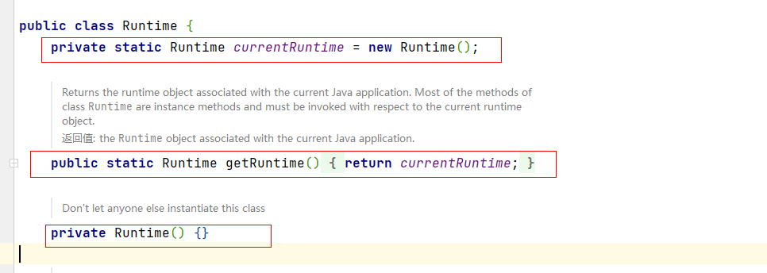
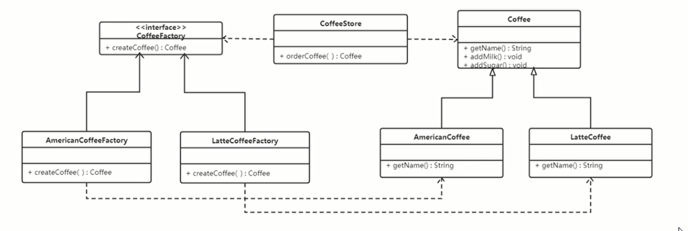
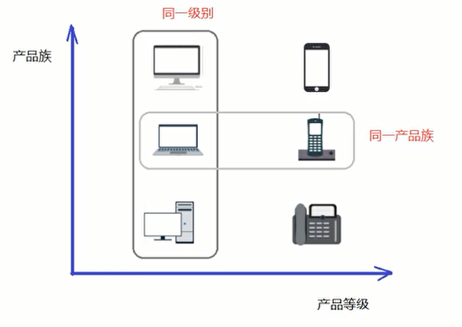

## 创建者模式

创建者模式关注点是如何创建对象，它的主要特点就是将对象的创建和使用相分离。这样可以降低系统的耦合度，使用者不需要关注对象的创建细节。

创建者模式分为以下几种：

- 单例模式。
- 工厂方法模式。
- 抽象工厂模式。
- 原型模式。
- 建造者模式。

## 单例模式

### 单例模式介绍

单例模式（Singleton Pattern）是 Java 中最简单的设计模式之一，这种类型的设计模式属于创建者模式。这种模式涉及到一个类，这个类创建自己的对象，并且保证只有一个对象被创建，再次创建则复用上一次创建的对象，所以叫做单例对象。

在对象创建之后，对外界提供一个唯一的访问对象的方式，可以直接访问，不需要实例化该类的对象。

单例模式分为两类：

- 饿汉式：类加载就会创建对象。
- 懒汉式：只有使用到对应的类才会创建对象。

### 单例模式实现

#### 饿汉式：

**方式一：使用静态变量的方式**

```java
/**
* 饿汉式单例模式，静态变量的方式
*/
public class Singleton {

  // 1. 私有构造方法。
  private Singleton() {
  }

  // 2. 在本类中创建本类对象。
  private static Singleton instance = new Singleton();

  // 3. 提供一个公共的访问方式让外界获取该对象、
  public static Singleton getInstance() {
    return instance;
  }
}
```

```java
public class Client {
  public static void main(String[] args) {
    Singleton instance = Singleton.getInstance();
    Singleton instance2 = Singleton.getInstance();
    // 比较地址
    System.out.println(instance == instance2);
  }
}
```

**方式二：使用静态代码块的方式**

```java
/**
* 饿汉式单例模式：使用静态代码块的方式
*/
public class Singleton {
  // 1. 私有构造方法
  private Singleton() {
  }

  private static Singleton instance;

  // 2. 静态代码块进行赋值
  static {
    instance = new Singleton();
  }

  public static Singleton getInstance() {
    return instance;
  }
}
```

总结：无论是使用静态变量还是静态代码块的方式，都是在类加载的时候就初始化了，所以会出现浪费内存的问题。

**方式三：枚举类加载方式**

```java
/**
* 饿汉式单例模式，枚举类方式
*/
public enum Singleton {
  INSTANCE;
}
```

枚举类方式同样属于饿汉式单例模式，因为枚举类是线程安全的，并且只会装载一次。枚举的写法十分简单，并且枚举类型是唯一一种不会被破坏的单例模式。所以在不考虑浪费空间的情况下，优先选择枚举类的单例模式。

#### 懒汉式

**方式一：线程不安全**

```java
public class Singleton {
  // 1. 私有化构造方法
  private Singleton() {
  }

  private static Singleton instance;

  // 2. 首次使用类创建，其余返回已有的
  public static Singleton getInstance() {
    if (instance == null) {
      instance = new Singleton();
    }
    return instance;
  }
}
```

这种方式其实是有问题的，在多线程状况下很有可能破坏我们想要的单例模式。

**方式二：线程安全**

```java
public class Singleton {
  private Singleton() {
  }

  private static Singleton instance;
  // 解决线程问题，其实只需要加上一个 synchronized 关键字即可，可以保证同一时间只有一个线程使用此方法。
  public static synchronized Singleton getInstance() {
    if (instance != null) {
      instance = new Singleton();
    }
    return instance;
  }
}
```

使用关键字 `synchronized` 虽然可以解决线程不安全的问题，但是同样会引起性能问题，因为只有第一次执行此方法的时候，变量 `instance` 才会执行赋值操作，其余的时间都是在执行获取 `instance` 的操作，而获取 instance 本身就是安全的。

**方式三：双重检测锁**

```java
package com.maple.pattern.singleton.demo4;

public class Singleton {

  private Singleton() {
  }

  // 多线程模式下可能会出现空指针问题，原因是 JVM 在实例化对象的时候可能会被 CPU 进行指令重排操作（有兴趣可以去看并发编程），所以使用 volatile 能保证可见性和有序性。
  private static volatile Singleton instance;

  public static Singleton getInstance() {
    // 首次判断，假如 instance 不为 null，则直接返回对象，提升效率，但是这仍然挡不住线程问题
    if (instance == null) {
      // 使用同步代码块锁当前类，挡住线程问题
      synchronized (Singleton.class) {
        // 第二次判断
        if (instance==null){
          instance = new Singleton();
        }
      }
    }
    return instance;
  }
}
```

双重检测锁模式仅仅锁住了赋值的操作也就是写操作，提升了性能。并且使用 `volatile` 来保证了可见性和有序性。我们推荐使用双重检查锁模式。

**方式四：静态内部类方式**

```java
public class Singleton {
  private Singleton() {
  }

  private static class SingletonHolder{
    private static final Singleton INSTANCE = new Singleton();
  }

  private static Singleton getInstance(){
    return SingletonHolder.INSTANCE;
  }
}
```

JVM 在加载外部类的时候并不会加载内部类，只有内部类的属性/方法被调用的时候才会被加载，并且初始化其静态属性。静态属性由于被 static 修饰，保证只实例化一次，并且严格保证执行顺序（解决指令重排）。

静态内部类是一种极其优秀的单例模式，是开源项目中比较常用的一种方式。在没有加任何锁的情况下，保证了多线程下的安全，并且没有任何的性能和空间的浪费。

---

在 JDK 中，有大量的类都使用到了单例模式，比如 `Runtime`。



## 工厂模式

在 Java 中，万物皆对象，这些对象都需要去创建。如果在创建的时候都去 new 对象，那么其实和对应的类耦合度会很高。比如像我们之前使用的多态，虽然比较方便，但是耦合度其实也是比较高的。如果我们需要更换对象，那么所有需要使用到该对象的地方都需要更改代码，这显然违反了开闭原则（对修改关闭）。

假如我们使用工厂来生产对象，那么我们要更换对象的时候只需要更改工厂的内容即可。达到了与对象解耦的目的（耦合不可能完全解除，我们要做的只是降低耦合度）。

下面我们进行三种工厂模式的讲解：

- 简单工厂模式（其实它不属于 23 种设计模式之一，反而像变成习惯，但是在平时使用中太多了）。
- 工厂方法模式。
- 抽象工厂模式。

### 简单工厂模式

简单工厂模式其实不是 23 种设计模式之一，但是因为它在平时使用太多了，所以讲一下。

简单工厂模式包含以下角色：

- 抽象产品：定义了产品的规范，描述了产品的主要功能和特性。
- 具体产品：实现或者继承了抽象产品的子类。
- 具体工厂：提供了创建产品的方法，调用者通过该方法来创建产品。


类图如上图，分为抽象产品（Coffee）、具体产品（AmericanCoffee、LatteCoffee）、具体工厂（SimpleCoffeeFactory）、测试类（CoffeeStore）。

**简单工厂模式实现**

```java
/**
 * 抽象类
 */
public abstract class Coffee {

  abstract String getName();

  String getMilk(){
    return "加奶";
  };
  String getSugar(){
    return "加糖";
  };
}
```

```java
/**
 * 美式咖啡
 */
public class AmericanCoffee extends Coffee{
  @Override
  String getName() {
    return "美式咖啡";
  }
}

/**
 * 拿铁咖啡
 */
public class LatteCoffee extends Coffee{
  @Override
  String getName() {
    return "拿铁咖啡";
  }
}
```

```java
public class SimpleCoffeeFactory {

  public Coffee createCoffee(String type){
    Coffee coffee = null;

    switch (type){
      case "American":
        return new AmericanCoffee();
      case "Lattee":
        return new LatteCoffee();
    }

    return coffee;
  }
}
```

```java
public class CoffeeStore {
  public static void main(String[] args) {
    SimpleCoffeeFactory factory = new SimpleCoffeeFactory();
    AmericanCoffee americanCoffee = (AmericanCoffee) factory.createCoffee("American");
    System.out.println(americanCoffee.getName());
  }
}
```

**简单工厂模式的优缺点**

优点：

- 封装了创建对象的过程，可以通过参数直接获得对象，将对象的创建和业务逻辑层分离。降低了使用和创建的耦合，更容易维护。

缺点：

- 增减产品还是需要修改工厂类的代码，其实还是违反了开闭原则。这也是为什么没有收录到 23 种设计模式中的原因之一。

**扩展：静态工厂**

其实在开发中，还是有一部分人将工厂类中的创建功能定义为静态的，这也不是 23 种设计模式中的一种，代码如下：

```java
public class SimpleCoffeeFactory {

  public static Coffee createCoffee(String type){
    Coffee coffee = null;
    switch (type){
      case "American":
        return new AmericanCoffee();
      case "Lattee":
        return new LatteCoffee();
    }
    return coffee;
  }
}
```

### 工厂方法模式

简单工厂模式其实还是违背了开闭原则，假如我们使用工厂方法模式就可以解决这个问题。它的思想就是定义一个用于创建对象的接口，让子类去决定实例化哪一个产品类对象。

**工厂方法模式的主要角色**

- 抽象工厂（Abstract Factory）：提供了创建产品的接口，调用者通过它来访问具体工厂的工厂方法来创建产品。
- 具体工厂（Concrete Factory）：实现了抽象工厂中的抽象方法，完成具体产品的创建。
- 抽象产品（Product）：定义了产品规范，描述产品的主要功能和特性。
- 具体产品（Concrete Product）：实现了抽象产品角色所定义的接口，由具体工厂创建，和具体工厂之间一一对应。

**实现**



上面的类图描述的就是工厂方法模式中的角色关系：

- 右边的部分：

    首先就是 Coffee 接口，其中具体的实现类有 AmericanCoffee，LatteCoffee。

- 中间的部分：

    中间的 Coffee Store 是咖啡店，拥有点咖啡的功能。
    它依赖于 Coffee，也就是依赖于抽象不依赖于具体实现，符合我们之前说的依赖倒转原则。

- 左边的部分：

    首先有一个 CoffeeFactory 的接口，拥有 createCoffee 方法。
    具体的实现类有 AmericanCoffeeFactory（生产美式咖啡），LatteCoffeeFactory（生产拿铁咖啡）。

```java
public abstract class Coffee {
  abstract String getName();

  String addMilk(){
    return "加奶";
  }

  String addSuger(){
    return "加糖";
  }
}

public class AmericanCoffee extends Coffee{
  @Override
  String getName() {
    return "美式咖啡";
  }
}

public class LatteCoffee extends Coffee{
  @Override
  String getName() {
    return "拿铁咖啡";
  }
}
```

```java
public interface CoffeeFactory {
  Coffee createCoffee();
}

public class AmericanCoffeeFactory implements CoffeeFactory{
  @Override
  public Coffee createCoffee() {
    return new AmericanCoffee();
  }
}

public class LatteCoffeeFactory implements CoffeeFactory{
  @Override
  public Coffee createCoffee() {
    return new LatteCoffee();
  }
}
```

```java
@Data
@AllArgsConstructor
public class CoffeeStore {

  private CoffeeFactory factory;

  Coffee orderCoffee(){
    Coffee coffee = factory.createCoffee();
    coffee.addMilk();
    coffee.addSuger();
    return coffee;
  }
}
```

```java
public class Client {
  public static void main(String[] args) {
    AmericanCoffeeFactory factory = new AmericanCoffeeFactory();
    CoffeeStore coffeeStore = new CoffeeStore(factory);
    System.out.println(coffeeStore.orderCoffee());
  }
}
```

**工厂方法模式的优缺点**

优点：
- 首先工厂方法模式完全符合开闭原则（对扩展开放，对修改关闭）。
- 用户获取产品只需要知道具体的工厂，无需知道具体的创建过程。

缺点：
- 要增加内容的时候需要增加工厂和对应的产品，创建的对象有点多，增加了系统的复杂性。

### 抽象工厂模式

**抽象工厂模式介绍**



上面我们讲的工厂方法模式只是生产同一类的产品，比如说 CoffeeFactory 只会生产咖啡，不管是什么品牌的咖啡都可以生产。这种情况我们叫做<u>只生产同一级别的产品</u>。

苹果厂商可以生产苹果手机，也可以生产苹果电脑，但是不关生产什么，都是同一个品牌，这个情况叫做<u>生产同一个产品族的产品</u>。

抽象工厂模式就是可以<u>获取同一个产品组的产品</u>的设计模式，比如说，利用抽象工厂模式获得某一个品牌的衣服和裤子。

抽象工厂的角色如下：

- 抽象工厂（Abstract Factory）：提供了创建产品的接口，定义了同一个产品族的不同等级的产品。
- 具体工厂（Concrete Factory）：完成具体产品的创建。
- 抽象产品（Abstract Product）：定义产品规范，描述产品主要功能特性。
- 具体产品（Concrete Product）：实现抽象产品的接口，和具体工厂一一对应。

**实现**

我们之前举的例子都是咖啡类，现在我们仍然以咖啡举例，不过咖啡店的业务现在发生了改变，除了生产咖啡还要生产甜点。
现在有：咖啡（美式咖啡、拿铁咖啡），甜点（提拉米苏，抹茶慕斯）

$$\begin{array}{c|lll}
&{咖啡}&{甜点}\\
\hline
{意大利风味}&{拿铁咖啡}&{提拉米苏}\\
{美式风味}&{美式咖啡}&{抹茶慕斯}\\
\end{array}$$

```java
public abstract class Coffee {
  abstract String getName();

  String addMilk(){
    return "加奶";
  }

  String addSuger(){
    return "加糖";
  }
}

public class AmericanCoffee extends Coffee {
  @Override
  String getName() {
    return "美式咖啡";
  }
}

public class LatteCoffee extends Coffee {
  @Override
  String getName() {
    return "拿铁咖啡";
  }
}
```

```java
/**
 * 甜品抽象类
 */
public abstract class Dessert {
  public abstract String show();
}

public class Trimisu extends Dessert{
  @Override
  public String show() {
    return "提拉米苏";
  }
}

public class MatchaMousse extends Dessert {
  @Override
  public String show() {
    return "抹茶慕斯";
  }
}
```

```java
public interface DessertFactory {

  Coffee createCoffee();

  Dessert createDessert();
}

/**
 * 美式风味工厂
 */
public class AmericanDessertFactory implements DessertFactory{
  @Override
  public Coffee createCoffee() {
    return new AmericanCoffee();
  }

  @Override
  public Dessert createDessert() {
    return new MatchaMousse();
  }
}

/**
 * 意大利风味工厂
 */
public class ItalyDessertFactory implements DessertFactory{
  @Override
  public Coffee createCoffee() {
    return new LatteCoffee();
  }

  @Override
  public Dessert createDessert() {
    return new MatchaMousse();
  }
}
```

```java
public class Client {
  public static void main(String[] args) {
    AmericanDessertFactory americanDessertFactory = new AmericanDessertFactory();
    Coffee coffee = americanDessertFactory.createCoffee();
    Dessert dessert = americanDessertFactory.createDessert();
  }
}
```

**抽象工厂模式优缺点和使用场景**

优点：

- 当一个产品族中的多个对象被设计成一起工作时，能够保证客户端始终使用一个产品组中的对象。

缺点：

- 当产品组需要新加一类新的产品时，所有的工厂类都需要进行修改。（比如现在是只有甜品和咖啡，但是如果想要再加一类饮料，就要修改所有的代码）。

使用场景：

- 当需要创建的对象是一系列相关的或者相互依赖的产品时，可以使用抽象工厂模式。
- 系统中有多个产品族，但是每次只使用其中一个产品族中的产品，比如某人只喜欢穿一个品牌的衣服裤子。

### 工厂模式扩展

在实际的应用中，经常有一种固定的写法：配置文件 + 反射的方式，来进行类的创建：

- 在 `resources/bean.properties` 下，编写类的全路径：

    ```properties
    public abstract class Coffee {
      abstract String getName();

      String addMilk(){
        return "加奶";
      }

      String addSuger(){
        return "加糖";
      }
    }

    public class LatteCoffee extends Coffee {
      @Override
      String getName() {
        return "拿铁咖啡";
      }
    }

    public class AmericanCoffee extends Coffee {
      @Override
      String getName() {
        return "美式咖啡";
      }
    }
    ```

- 使用反射的方式直接创建对象：

    ```java
    public class CoffeeFactory {
      private static Map<String, Coffee> factory = new HashMap<>();

      static {
        Properties properties = new Properties();
        InputStream inputStream = CoffeeFactory.class.getClassLoader().getResourceAsStream("bean.properties");
        try {
          properties.load(inputStream);
          for (Object key : properties.keySet()) {
            String className = properties.getProperty((String) key);
            Coffee coffee = (Coffee) Class.forName(className).newInstance();
            factory.put((String) key,coffee);
          }
        } catch (Exception e) {
          e.printStackTrace();
        }
      }

      public static Coffee createCoffee(String coffee){
        return factory.get(coffee);
      }
    }
    ```

- 测试：

    ```java
    public class Client {
      public static void main(String[] args) {
        Coffee coffee = CoffeeFactory.createCoffee("american");
        System.out.println(coffee.getName());
      }
    }
    ```

## 原型模式

类似克隆羊，使用一个已经创建的实例作为原型，通过复制将该原型对象来创建一个和原型对象相同的新对象。

原型模式包含以下角色：

- 抽象原型类：规定了具体原型对象必须实现的 `clone()` 方法。
- 具体原型类：实现了抽象原型类的 `clone()` 方法，它是可以被复制的对象。
- 访问类：使用具体原型类中的 `clone()` 方法来复制新的对象。

原型模式的克隆分为浅克隆和深克隆：

- 浅克隆：创建一个新对象，新对象的属性和原来的对象完全相同，但是对于非基本类型，指向的是原对象的地址值。
- 深克隆：创建一个新对象，新对象的属性（无论是基本类型还是非基本类型）都会被克隆。

**原型模式（浅克隆）实现**

Java 中的 Object 类提供了 `clone` 方法来实现浅克隆，`Cloneable` 接口是上面类图中的抽象原型类，而实现了接口 `Cloneable` 的就是具体的原型类。所以直接写具体原型类即可。

```java
/**
 * 浅克隆
 */
public class Realizetype implements Cloneable{
  @Override
  public Realizetype clone() throws CloneNotSupportedException {
    return (Realizetype) super.clone();
  }
}
```

```java
public class Client {
  public static void main(String[] args) throws CloneNotSupportedException {
    Realizetype realizetype = new Realizetype();
    Realizetype clone = realizetype.clone();
    System.out.println(realizetype == clone);
  }
}
```

**原型模式（深克隆）实现**

下面我们做一个奖状类，实现奖状类的克隆。但是奖状是属于学生的，所以奖状类中要有学生，这就可以实现深克隆。

假如要实现深克隆，就要使用到对象流。它的思想就是将对象序列化到磁盘上，然后再次读取的时候就会创建一个新的对象。

```java
@Data
@AllArgsConstructor
public class Student implements Serializable {
  private String name;
}
```

```java
@Data
public class Citation implements Cloneable, Serializable {

  private Student student;

  public void show(){
    System.out.println(student.getName() + "同学得到奖状");
  }

  @Override
  protected Citation clone() throws CloneNotSupportedException {
    return (Citation) super.clone();
  }
}
```

```java
public class Client {
  public static void main(String[] args) throws CloneNotSupportedException, IOException, ClassNotFoundException {
    // 原型
    Citation citation = new Citation();
    citation.setStudent(new Student("张三"));

    // 克隆
    ObjectOutputStream oos = new ObjectOutputStream(new FileOutputStream("D:/Utils/a.txt"));
    oos.writeObject(citation);
    oos.close();

    ObjectInput ois = new ObjectInputStream(new FileInputStream("D:/Utils/a.txt"));
    Citation clone = (Citation) ois.readObject();
    ois.close();

    clone.setStudent(new Student("李四"));

    citation.show();
    clone.show();
  }
}
```

注意必须实现序列化接口，否则就会抛出异常。

## 建造者模式

建造者模式其实就是将构建和装配两部分相互分离，让同样的构建过程有可能会创建不同的表示的设计模式。


如上图，现在有一台电脑，它的组件如左边的部分，它的组成如右边的部分：

- 部件的构造就是形成左边部分的组件内容。
- 部件的装配就是左边组装成右边电脑的过程。

对于用户来说，他不需要去关心左边的组件是怎么样的，他只关心右边电脑的成品，也就是说只需要知道右边产品的类型，就可以通过建造者模式将成品组装起来。

由于实现了构建和装配的解耦合，所以不同的组件，即使使用相同的构建过程最终产生的产品也不相同。同样的，即使使用相同的组件，构建过程相同最终的产品也有可能不同（这一点在上图没有体现，不过确实存在这种情况）。

我们现在将这些组件的构造交给 Builder 去负责，将组件的构建过程交给 Director 负责，所以建造者模式存在以下角色：

- 抽象建造者类（Builder）：这个接口/抽象类规定了要实现复杂对象的哪些部分的创建，不涉及具体部件的创建。
- 具体建造者类（ConcreteBuilder）：实现 Builder 接口，完成复杂产品中各个部件的创建。
- 指挥者类（Director）：完成复杂对象各个部件的组装，不涉及具体的产品信息，只负责保证组件的组装过程，形成最终的产品类。
- 产品类（Product）：要最终完成的产品。

**实现**

使用自行车来练习建造者模式，一个具体的自行车包含车架、车座等部件，而车架有各种分类（铝合金的、碳纤维的），车座也有各种分类（橡胶的、真皮的）。

对于自行车来说，产品 Product 就是 Bike，抽象建造者是 Builder，具体建造者是 MobikeBuilder 和 OfoBuilder，指挥者是 Director。

```java
/**
 * 自行车
 */
@Data
@AllArgsConstructor
@NoArgsConstructor
public class Bike {
  private String frame;
  private String seat;
}
```

```java
/**
 * 建造者抽象类
 */
public abstract class Builder {

  protected Bike bike = new Bike();

  public abstract void buildFrame();

  public abstract void buildSeat();

  // 构建自行车的方法
  public abstract Bike createBike();

}
```

```java
/**
 * Mobile 单车
 */
public class MobileBuilder extends Builder{
  @Override
  public void buildFrame() {
    bike.setFrame("碳纤维车架");
  }

  @Override
  public void buildSeat() {
    bike.setSeat("真皮车座");
  }

  @Override
  public Bike createBike() {
    return bike;
  }
}

/**
 * Ofo 单车
 */
public class OfoBuilder extends Builder{
  @Override
  public void buildFrame() {
    bike.setFrame("铝合金车架");
  }

  @Override
  public void buildSeat() {
    bike.setSeat("橡胶车座");
  }

  @Override
  public Bike createBike() {
    return bike;
  }
}
```

```java
/**
 * 指挥者
 */
@AllArgsConstructor
public class Director {

  private Builder builder;

  /**
   * 组装自行车，设置构建顺序（首先是车架，然后是车座）
   * @return 自行车
   */
  public Bike constructor(){
    builder.buildFrame();
    builder.buildSeat();
    return builder.createBike();
  }
}
```

```java
public class Client {
  public static void main(String[] args) {
    Bike bike = new Director(new MobileBuilder()).constructor();
    System.out.println(bike.toString());
  }
}
```

**注意**

上面的实例是 Builder 模式的标准用法，但是看起来系统结构比较复杂，所以很多时候我们就会将此系统进行简化，也就是将指挥者 Director 和抽象建造者 Builder 进行结合，如下：

```java
public abstract class Builder {

  protected Bike bike = new Bike();

  public abstract void buildFrame();

  public abstract void buildSeat();

  // 构建自行车的方法
  public abstract Bike createBike();

  public Bike builde(){
    return this.createBike();
  }

}
```

```java
public class Client {
  public static void main(String[] args) {
    Bike bike = new MobileBuilder().builde();
    System.out.println(bike.toString());
  }
}
```

虽然这样做确实是简化了系统结构，但是同样也加重了抽象建造者模式的职责，不太符合单一职责原则，假如抽象产品的组装过程确实复杂，建议还是抽出来一层指挥者 Director 来实现组装过程。

**建造者模式的优缺点和使用场景**

优点：

- 建造者模式的封装性很好，假如有新的需求，那么新加一个建造者即可。假如组装的过程经常变更，那么只需要更改指挥者 Director 即可。
- 可以更精细地控制组装的过程。

缺点：

- 建造者模式创建的产品一般有较多的共同点，也就是说组成结构相似，假如产品之间的差异过大，那么不太适合使用建造者模式。

使用场景：

- 建造者模式的产品中各个部分经常面临剧烈变化，但是将它们组合到一起的算法相对稳定。所以可以根据这个特点来进行选择。

**扩展**

假如一个类需要非常多的参数（而且参数不固定，可能是一个参数有多个选择）才可创建，可读性较查，这个时候我们就可以使用建造者模式来进行重构。

重构之前（用四个参数做个例子）：

```java
@Data
@AllArgsConstructor
@NoArgsConstructor
public class Phone {

  private String cpu;
  private String screen;
  private String memory;
  private String mainboard;

}
```

重构之后：

```java
public class Phone {

  private String cpu;
  private String screen;
  private String memory;
  private String mainboard;

  @Override
  public String toString() {
    return "Phone{" +
        "cpu='" + cpu + '\'' +
        ", screen='" + screen + '\'' +
        ", memory='" + memory + '\'' +
        ", mainboard='" + mainboard + '\'' +
        '}';
  }

  private Phone(Builder builder){
    this.cpu = builder.cpu;
    this.screen = builder.screen;
    this.memory = builder.memory;
    this.mainboard = builder.mainboard;
  }

  public static final class Builder {
    private String cpu;
    private String screen;
    private String memory;
    private String mainboard;

    public Builder cpu(String cpu) {
      this.cpu = cpu;
      return this;
    }

    public Builder screen(String screen) {
      this.screen = screen;
      return this;
    }

    public Builder memory(String memory) {
      this.memory = memory;
      return this;
    }

    public Builder mainboard(String mainboard) {
      this.mainboard = mainboard;
      return this;
    }

    public Phone build(){
      return new Phone(this);
    }
  }

}
```

```java
public class Client {
  public static void main(String[] args) {
    Phone phone = new Phone.Builder()
        .cpu("intel")
        .screen("三星")
        .mainboard("金士顿")
        .mainboard("华硕")
        .build();
    System.out.println(phone);
  }
}
```

这种虽然设计起来比较复杂，但是使用起来异常方便。

## 创建者模式的对比

工厂方法模式 vs 建造者模式：

- 工厂方法模式注重的是整体对象的创建方式。
- 建造者模式注重的是部件构建的过程。

抽象工厂模式 vs 建造者模式：

- 抽象工厂模式实现对产品家族的创建，比如说相同品牌的不同产品。
- 建造者模式要求按照指定的蓝图即按照产品，它的主要目的是通过组装零配件产生一个新的产品。
