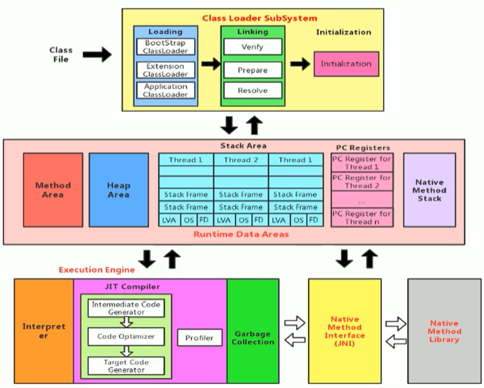
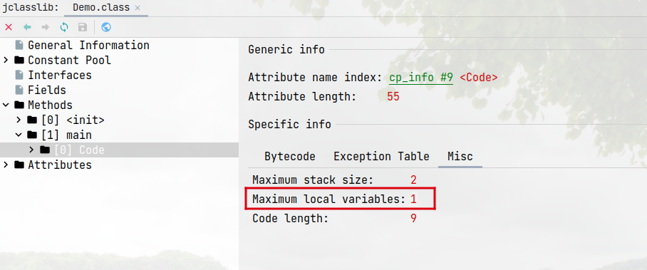

## 运行时数据区概述

### 运行时数据区的结构和作用



类加载子系统之后，进入了运行时数据区（Runtime Data Area），其实运行时数据区就类似一个存储容器，但是不做任何的计算操作，真正的计算操作是执行引擎在做的内容。

所以运行时数据区和执行引擎的关系有点类似与内存和 CPU 之间的关系，内存也是一个存储容器，CPU 才是计算的人。

其实运行时数据区使用的就是内存，不同的 JVM 对内存的划分方式和管理机制存在差异，这里我们就是用 Hotspot 来作为主要的探索对象。

上图是一个详细版本的，但是不是非常直观，下面放出一个比较直观的图像：


注意 JIT 缓存，不同人对 JIT 缓存划分的区域有不同的见解，但是有一点是非常明确的：它是非堆空间。

---

在运行时数据区中划分为了很多空间，在这其中，有一些是跟随虚拟机启动而创建，随着虚拟机退出而销毁的，它们的生命周期就是虚拟机的生命周期。还有一些是和线程一一对应的，它们的生命周期就是线程的生命周期。

在下图中，灰色部分是单独线程私有的，红色部分是多个线程之间共享的，也就是红色部分是有可能产生线程安全问题的部分。


线程私有：

- PC 寄存器（程序计数器）。
- 栈。
- 本地方法栈。

线程间共享：

- 堆。
- 堆外内存（方法区、JIT 缓存）。

1. 堆和方法区是线程之间共有的，所以会涉及到线程的安全问题。
1. 堆和方法区都可以进行垃圾回收，但是可以说绝大多数都会在堆中，只有少数在方法区中。
1. 方法区其实只是一个抽象的概念，它的落地实现在不同版本中有所不同（也就是通常说的永久带和元空间）。

---

每一个 JVM 都会有独一无二的 Runtime 实例，这个 Runtime 实例其实就可以理解为我们的运行时数据区。


---

### JVM 中的线程

JVM 允许一个或多个线程并行执行，**在 Hotspot JVM 中，每一个线程都和操作系统的本地线程一对一对应**，因为线程其实是操作系统的本地线程，Java 并不能直接调用操作系统，所以需要的是一个映射关系来对应操作系统。

当 Java 线程准备好了之后（例如 PC 寄存器、栈存储等），本地线程才开始创建。一旦本地线程执行成功，就会调用 Java 线程中的 `run()`。假如 `run()` 方法出现了一些异常，Java 线程就会终止，但是本地线程的内容还没有结束。

本地线程要在确认 JVM 是否要终止，这个参考条件就是当前终止的 Java 线程是不是最后一个非守护线程，也就是说当程序只剩下守护线程了，那么 JVM 就可以退出了。

在 Hotspot 中，守护线程主要有这样几个：

- 虚拟机线程。
- 周期任务线程。
- GC 线程。
- 编译线程。
- 信号调度线程。

## PC 寄存器（程序计数器）

PC 寄存器其实是对物理 PC 寄存器的一个模拟，实际上它和物理机的寄存器不是一个东西。

PC 寄存器的主要作用就是存储下一条执行的地址，也就是即将执行的指令代码，执行引擎会读取这个指令去执行。

PC 寄存器是线程私有的，也就是说每一个线程都会有一个 PC 寄存器，实际上，每一个线程在任何时间点中，只会有一个方法在运行，也就是所谓的**当前方法**（假如执行的是本地方法栈中的 native 方法，就是 undefined）。

- PC 寄存器是很小的一块空间，几乎可以忽略不计，它也是运行速度最快的一块区域。
- 在 JVM 规范中，规定了每个线程都要有自己的 PC 寄存器，生命周期与当前线程保持一致。
- 字节码解释器工作就是依赖 PC 寄存器的值来选取下一条需要执行的字节码指令。
- 唯一一个在 Java 虚拟机规范中，没有规定任何 `OutOfMemoryError` 的区域。

**为什么需要 PC 寄存器**

当 CPU 在切换线程之后，需要知道应该从那一条指令继续执行，这个时候应该有一个地方来存储下一条应该执行的指令，那么这就是 PC 寄存器的作用。

并且 PC 寄存器必须为线程私有，否则必定会出现线程之间互相干扰的情况。

## 虚拟机栈

### 虚拟机栈概述

**虚拟机栈出现的背景**

指令集架构有两种：

- 基于寄存器的指令集架构。
- 基于栈的指令集架构。

基于寄存器的指令集架构和硬件是绑定在一起的，执行指令时直接使用 CPU 来完成。由于使用高速缓冲区，所以执行速度快，但是无法做到跨平台。

基于栈的指令集架构是基于内存完成的，所以速度上不如基于寄存器的指令集架构，但是优点就是可以做到跨平台，可移植性良好。

JVM 一开始在设计的时候就是基于栈的指令集架构。由于跨平台的特性，Java 的很多指令都是基于栈来设计的。

**内存中的栈和堆**

虽然 JVM 内存结构中不仅仅只有栈和堆，但是这两个比较重要。栈说是运行时的单位，堆是存储时的单位：

- 堆需要解决的是存储的问题，数据应该怎么放，放在什么地方，全都是堆需要解决的问题。
- 栈需要解决的是运行的问题，程序应该如何与运行，如何去处理数据，全都是栈需要解决的问题。

整体看下来的关系是这样的，但是这个关系也不是绝对的，从局部来看，基本数据类型和对象引用也是要放在栈中的。

**栈的优点**

栈是一种比较快速有效的分配方式，它的访问速度仅仅次于 PC 寄存器。JVM 直接对栈进行的操作只有两个：

- 每个方法的执行都伴随着压栈（也就是入栈）。
- 方法执行结束出栈。

对于栈来讲，方法执行完成之后就出栈，方法没有执行完成就不会出栈，所以对于栈来讲，它的操作一目了然，根本就不需要进行调优的操作。

**栈的异常**

栈不存在垃圾回收问题，但是会出现其他的问题。

对于 Java 虚拟机来讲，它允许栈是动态的，也允许栈是固定大小的，但是这两种策略会导致两个问题：

- 假如栈是固定不变的，那么当一个栈只有入栈没有出栈，就可能导致 `StackOverflowError`。
- 假如栈是动态地，那么假如当一个栈只有入栈没有出栈，就可能导致电脑的总内存撑爆，也就是 `OutOfMemoryError`。

当然了，发生 OOM 的另一个可能就是栈太多了，也有可能出现这种问题。

**调节栈的大小**

我们可以使用参数 `-Xss` 选项来设置线程的最大栈空间，栈的大小直接决定了函数调用的最大可达深度。

### 栈帧概述

每一个线程都有自己单独的栈，而栈的存储单位就是栈帧（Stack Frame）。每一个线程中，每个执行的方法都对应着一个栈帧。

栈的结构并不简单，事实上，它是一个内存块，是一个数据集。

**栈运行原理**

- 栈的操作只有两种：压栈和出栈，遵循先进后出（First In，Last Out）的原则。
- 在一条活动线程中，在某一刻只会有一个栈帧在执行，也就栈的顶部的栈帧，这个栈帧被称为当前栈帧（Current Frame），与当前栈帧相对应的方法就是当前方法，定义这个方法的类就是当前类。
- 执行引擎运行的所有字节码指令只对当前栈帧进行操作。
- 如果在该方法中调用了其他的方法，对应的新的栈帧会被创建出来并入栈，称为新的栈顶。

上面说到，栈帧其实对应方法，一个方法就是一个栈帧。栈帧中存在如下结构：

- Local Variables：局部变量表
- Operand Stack：操作数栈，或者叫做表达式栈
- Dynamic Linking：动态链接
- Return Address：方法返回地址，方法正常或者异常退出的定义
- 一些附加信息

栈能存多少完全取决于栈帧的内部结构的大小，而栈帧内部结构的大小很大程度上来自局部变量表和操作数栈。


### 局部变量表（Local Variables）

**局部变量表概述**

局部变量表也叫做局部变量数组或者本地变量表，它其实是一个数字数组，主要存放的是方法参数和定义在方法体内部的局部变量（变量类型包括对象引用类型、返回值类型）。

> 它其实是一个数字数组

这个局部变量表其实是一个一维数组，从形参直到返回值都是局部变量表中的内容。但是这个数组是数字数组，也就是说所有基本类型的数字都算，而且所有能够被转为数字类型的都算。

byte、short、chart 会提前被 JVM 转为 int，char 是有对应 ASCII 或者 Unicode 的，所以当然也可以转为数字。boolean 中，false 为 0，true 为非零数。

对象引用地址、返回值类型，那么其实都可以使用 int 来表示了。

由于局部变量表建立在栈帧上，而栈帧是栈中内容，所以局部变量表不存在线程问题。而且局部变量的生命周期和栈帧一致，局部变量表中的变量只能在当前方法中使用。

局部变量表的所需容量大小是在编译期就确定下来的，并且会保存在方法的 Code 属性的 `maximum local variables`（局部变量表最大槽数） 中，方法运行期间不会改变局部变量表大小。



这个容量大小说的不是占用多大内存，而是指的几个变量，类似上图其实就是一个变量。

在栈中，局部变量表算是和性能调优、栈内存关系比较密切的一个结构，因为局部变量表中可能会存放一些对象的引用，不管是直接引用还是间接引用，这个对象都不能被 GC。

**字节码中方法内部结构剖析**

```java
public class Demo {

  public static void main(String[] args) {
    int a = 1;
    int b = 2;
  }
}
```


最大深度：3，也就是说局部变量表中存有三个变量。


- `Start PC` 指的是字节码中的起始位置。
- `Line Number`：和代码中变量的位置有关。


- `LocalVariablesTable`：局部变量表，可以看到有三个变量：`args`、`a`、`b`。
- `Start PC`：字节码中的位置。
- `Length`：字节码的作用长度。
- `Start PC + Length`：当前变量在字节码中的作用范围。

**变量槽**

之前说局部变量表是一个数值类型的数组，这个数组的基本单元我们称之为槽（slot），也就是变量槽。

在局部变量表中，不同的数值类型的存储是有区别的，32 位只占用一个 slot，64 位占用两个 slot。

例如 byte、short、chart、boolean、int，在 slot 存储时全都使用 int 存储，自然占用 1 个 slot，float 也占用一个 slot。对于 double、long 来讲，自然占用两个 slot。

对于占用两个 slot 的变量来讲，它对应的局部变量表的数组对应的是两个下标，我们取起始下标。


上图中，b 为 long 类型，索引为 2，但是后面的 c 直接从 4 开始，这也证明 64 位占用两个 slot。

---

假如当前方法是通过构造方法或者非静态方法创建的，那么该对象的引用（this）会存放到当前栈帧局部变量表的 0 号索引处。


首先是 Demo 类，当前的 `main()` 方法并非实例方法，所以第一个参数就是 args。


然后是 Person 类，当前的 `test()` 方法是实例方法，所以第一个参数是当前引用 this。

**成员变量和局部变量的对比**

- 成员变量（在类中定义的变量）：

    - 类变量：使用 `static` 修饰，属于类的变量。

        在类的加载过程中，有一个链接阶段，在链接阶段中的准备阶段有一次默认的赋值操作。之后在加载过程中的初始化阶段会显示赋值。

    - 实例变量：在类中直接声明的变量，属于对象的变量。

        对象创建时会在堆中分配实例变量空间，之后进行默认的赋值操作。

- 局部变量（在方法中定义的变量）：

    使用之前必须显示进行赋值操作，没有默认赋值操作。

### 操作数栈（Operand Stack）

**操作数栈概述**


每一个栈帧中，除了局部变量表，还有一个操作数栈，也叫做操作栈。操作数栈是使用数组来进行实现的。

虽然操作数栈是基于数组来进行实现的，但是它仍然是栈，也就是说不使用下标来访问，而是使用入栈出栈的方式访问元素。

操作数栈的具体作用就是用来保存计算的中间结果，具体流程如下：

1. 操作数栈从局部变量表中拿到数据。
1. 执行引擎从操作数栈中拿到数据。
1. 执行引擎进行计算，得到结果。
1. 执行引擎算出的结果放到操作数栈中。
1. 重复操作：操作数栈 -> 执行引擎 -> 操作数栈，直到所有计算全部完成。
1. 将结果同步到局部变量表中。

以上局部变量表 -> 操作数栈 -> 执行引擎，这个数据流转的方向类似于电脑中 硬盘 -> 内存 -> CPU 的关系，JVM 本来就是仿照这样的结构来设计的。所以有一句话叫做 JVM 是基于栈的执行引擎。

刚才说操作数栈是使用数组来实现的，所以它的大小其实早在编译期间就已经确定了。


操作数栈的空间分配规则类似局部变量表：

- 32 位占用一个栈单位的深度。
- 64 位占用两个栈单位的深度。

byte、short、char、boolean 会转为 int 存储。

**局部变量表、操作数栈、执行引擎的使用**

```java
public class Demo {
    public static void main(String[] args) {
        test();
    }

    public static void test() {
        byte i = 15;

        int j = 8;

        int k = i + j;
    }
}
```


以上代码的操作数栈深度：2，局部变量表长度：3，字节码长度：11。


字节码如上图，进行了如下操作：

```
# 将 15 push 进操作数栈 Operand Stack 中
0: bipush        15
# 将 15 从 Operand Stack 中 pop 出来，并且存放到 Local Variables 中索引为 0 的位置中
2: istore_0
# 将 8 push 到 Operand Stack 中
3: bipush        8
# 将 8 从 Operand Stack 中 pop 出来，并存放到 Local Variables 中索引为 1 的位置中
5: istore_1
# 将 Local Variables 中索引为 0 的位置中的数据取出，push 进 Operand Stack 中
6: iload_0
# 将 Local Variables 中索引为 1 的位置中的数据取出，push 进 Operand Stack 中
7: iload_1
# 将 Operand Stack 栈顶和栈顶前一位的数据相加，并重新 push 到 Operand Stack 中
8: iadd
# 将 Operand Stack 中的数据 pop 出来，并存放到 Local Variables 中索引为 2 的位置中
9: istore_2
# 退出
10: return
```

因为操作数栈其实是存储在内存中的，所以频繁读写肯定会影响执行速度。Hotspot JVM 提出了栈顶缓存的概念，也就是说将栈顶元素全部都缓存到物理 CPU 的寄存器中，以此来降低对内存的读写次数，提高执行引擎的执行效率。

### 动态链接（Dynamic Linking）

**动态链接**


之前已经讲过局部变量表，操作数栈，下面是动态链接。

这里的动态链接不是真正的动态链接，它其实就是一个引用，里面放着的是运行时常量池中，这个方法的引用，保存这个引用地址的目的其实是为了实现真正的动态链接。

在 Java 文件编译为字节码文件时，所有的方法引用和变量都作为符号引用保存在常量池中，动态链接的真正作用就是将符号引用转换为调用方法的直接调用。

举个例子：

```java
public class DynamicLinkDemo {

    int num = 1;

    public void A() {
    }

    public void B() {
        A();
        num++;
    }
}
```

当前定义了两个方法 A、B，然后在 B 中使用 A，将如上 Java 文件编译为字节码，之后使用 `javap -verbose DynamicLinkDemo.class` 转为字节码文件查看，或者可以使用 jclasslib 查看，这里使用这种方式比较好举例。

有条件可以使用 JClassLib 插件查看，比单纯看字节码要方便一些，看的时候注意首先要看方法，然后从方法中找到符号引用。

```text
Classfile /C:/Users/causes/Desktop/DynamicLinkDemo.class
  Last modified 2021-12-14; size 501 bytes
  MD5 checksum f078fcd1ceaa7a068fa01b25dc11c860
  Compiled from "DynamicLinkDemo.java"
public class causes.classloaders.DynamicLinkDemo
  minor version: 0
  major version: 52
  flags: ACC_PUBLIC, ACC_SUPER
-- 运行时常量池
Constant pool:
   #1 = Methodref          #5.#19         // java/lang/Object."<init>":()V
   #2 = Fieldref           #4.#20         // causes/classloaders/DynamicLinkDemo.num:I
   -- 使用了符号引用，符号引用指向的地址是 #4 和 #21
   #3 = Methodref          #4.#21         // causes/classloaders/DynamicLinkDemo.A:()V
   -- #4 仍然是符号引用，指向了 #22
   #4 = Class              #22            // causes/classloaders/DynamicLinkDemo
   #5 = Class              #23            // java/lang/Object
   -- 变量 num
   #6 = Utf8               num
   -- I 为 int
   #7 = Utf8               I
   #8 = Utf8               <init>
   -- 返回值类型 V，就是 void
   #9 = Utf8               ()V
  #10 = Utf8               Code
  #11 = Utf8               LineNumberTable
  #12 = Utf8               LocalVariableTable
  #13 = Utf8               this
  #14 = Utf8               Lcauses/classloaders/DynamicLinkDemo;
  -- 字符 A
  #15 = Utf8               A
  #16 = Utf8               B
  #17 = Utf8               SourceFile
  #18 = Utf8               DynamicLinkDemo.java
  #19 = NameAndType        #8:#9          // "<init>":()V
  -- 引用了 #6 和 #7
  #20 = NameAndType        #6:#7          // num:I
  -- 引用了 #15 和 #9
  #21 = NameAndType        #15:#9         // A:()V
  -- 保存的是类方法的名称
  #22 = Utf8               causes/classloaders/DynamicLinkDemo
  #23 = Utf8               java/lang/Object
{
  int num;
    descriptor: I
    flags:

  public causes.classloaders.DynamicLinkDemo();
    descriptor: ()V
    flags: ACC_PUBLIC
    Code:
      stack=2, locals=1, args_size=1
         0: aload_0
         1: invokespecial #1                  // Method java/lang/Object."<init>":()V
         4: aload_0
         5: iconst_1
         6: putfield      #2                  // Field num:I
         9: return
      LineNumberTable:
        line 3: 0
        line 5: 4
      LocalVariableTable:
        Start  Length  Slot  Name   Signature
            0      10     0  this   Lcauses/classloaders/DynamicLinkDemo;

  public void A();
    descriptor: ()V
    flags: ACC_PUBLIC
    Code:
      stack=0, locals=1, args_size=1
         0: return
      LineNumberTable:
        line 8: 0
      LocalVariableTable:
        Start  Length  Slot  Name   Signature
            0       1     0  this   Lcauses/classloaders/DynamicLinkDemo;

  public void B();
    descriptor: ()V
    flags: ACC_PUBLIC
    Code:
      stack=3, locals=1, args_size=1
         0: aload_0
         -- 使用了引用，对应的符号引用为 #3
         1: invokevirtual #3                  // Method A:()V
         4: aload_0
         5: dup
         -- 符号引用为 #2
         6: getfield      #2                  // Field num:I
         9: iconst_1
        10: iadd
        -- 符号引用为 #2
        11: putfield      #2                  // Field num:I
        14: return
      LineNumberTable:
        line 11: 0
        line 12: 4
        line 13: 14
      LocalVariableTable:
        Start  Length  Slot  Name   Signature
            0      15     0  this   Lcauses/classloaders/DynamicLinkDemo;
}
SourceFile: "DynamicLinkDemo.java"
```

```java
public class DynamicLinkDemo {
    static void eat(Animal animal) {
        animal.eat();
    }

    public static void main(String[] args) {
        eat(new Cat());
    }
}

class Animal {
    void eat() {
        System.out.println("吃");
    }
}

class Cat extends Animal {

    void eat() {
        System.out.println("猫吃鱼");
    }
}
```

毫无疑问，这个最终输出的是猫吃鱼，这个过程就叫做动态链接。

**解析与分派**

上面的动态链接说到了符号引用，通过符号引用找到了最终的方法地址，然后调用。

在 JVM 中，将符号引用转换为调用方法的直接引用，这个和方法的绑定机制有关，方法的绑定机制分为两种：动态链接、静态链接。

静态链接：在字节码被加载到 JVM 时，假如被调用的对象在编译期间已经确定了，并且在运行期间保持不变，那么这种符号引用到直接引用的过程叫做静态链接。

动态链接：这个动态链接不是栈帧中的内部结构，而是真正的动态链接，也就是方法的绑定机制。假如方法不能在编译期间确定，也就是说只能在方法的运行过程中将符号引用转换为直接引用，这个过程叫做动态链接。

静态链接和动态链接都需要将符号引用转换为直接引用，区别就是是否能在编译期间就确定转换为何种直接引用。

**早期绑定和晚期绑定**

早期绑定和静态链接对应，晚期绑定和动态链接对应。绑定和链接的区别就是，链接可以看成是绑定的一个子集。绑定的范围包括类、方法、变量，而链接只是针对方法。

早期绑定就是在编译期可知，并且在运行期间保持不变。晚期绑定就是在编译期无法确定，只有在运行期间才可以确认的。

**虚方法、非虚方法**

我们刚才在说动态链接的时候，说道最后符号引用转换为直接引用的过程叫做动态链接。但是我们在实际上调用的时候，还是使用的父类的形参去调用的方法，这个就表现为多态。

非虚方法有以下几种：

- 静态方法。
- 私有方法。
- final 方法。
- 实例构造器方法。
- 父类方法。

父类方法指的不是在子类中重写之后的方法，指的是在子类中使用 `super.方法()` 的意思。

这些方法其实都有一个共同的特点，也就是不能被重写的方法，都不能够实现多态的方法。除了这些方法，其他都是虚方法。

为了提高性能，JVM 在类的方法区中建立了虚方法表，方便使用索引查找。假如我们调用子类重写的方法，它会首先寻找子类中的虚方法表，找不到则向上查找，直到调用。

虚方法表形成在类的加载中，链接阶段的解析阶段。

### 方法返回地址（Return Address）


方法返回地址有些人将其划分到了帧数据区。

方法的返回地址其实就是栈帧中的一块区域，它存放的是调用该方法的 PC 寄存器的值。简单来讲就是此方法执行完成之后，执行引擎会根据它来确定下一条的指令应该执行什么。

在此时，方法的返回地址存放的指令和 PC 寄存器中存放的指令相同，但是它们两个用于不同的情况：PC 寄存器是线程中的使用，方法返回地址仅在方法中。

假如线程切换回来之后，执行引擎仍然需要依赖 PC 寄存器中的指令，反之线程没有切换时则不需要。

此情况只适合与方法正常退出的时候，假如方法出现了异常则不会采用。

### 一些附加信息

没什么东西。

## 本地方法栈

本地方法栈用来管理本地方法的调用，它类似虚拟机栈：

1. 线程私有。
1. 允许动态扩展或者固定。
1. 当某线程调用一个本地方法（native）时，此线程则不再受虚拟机限制，和虚拟机拥有相同权限。
1. 不是所有 JVM 都支持本地方法，要看具体实现。Java 虚拟机规范中并没有明确要求本地方法栈所使用的语言。

## 堆

### 堆的概述


在运行时数据区中，堆是最大的一个空间。调优过程主要是对堆进行调优。

一个 Java 程序是一个进程，而堆和方法区是对应一个进程的，进程中有多个线程，所以说多个线程其实是共享一个堆和方法区。

1. 一个 JVM 实例只存在一个堆，堆是 Java 内存管理的核心区域。
1. Java 堆区在 JVM 被启动时被创建，其空间大小也被确定了，是 JVM 管理的最大的一块区域（在 JVM 启动之前即可设置，堆内存大小可调）。
1. Java 虚拟机规范中规定，堆可以处于物理上不连续的内存空间中，但是在逻辑上应该被认为是连续的。
1. 所有的线程共享 Java 堆，在这里还可以单独给线程划分私有的缓冲区（Thread Local Allocation Buffer，TLAB）。
1. 几乎所有的对象实例和数组都应该分配到堆上。
1. 在方法结束之后，堆中的对象不会被立刻移除，而是要等到垃圾回收的时候来移除。
1. 尽量减少 GC 的次数，因为 GC 需要消耗资源，并且有些垃圾回收器会出现时停的效果，会影响正常的用户线程。

```java
System.out.println("start……");
new Thread(() -> {
  try {
    Thread.sleep(1000000);
  } catch (InterruptedException e) {
    e.printStackTrace();
  }
}).start();
```

之后打开 `JDK 的安装目录 --> bin --> jvisualvm.exe`，打开，可以看到：


这其实就是检测 JVM 的一个工具，点击 `工具 --> 插件 --> 可用插件`，在搜索框中 `Visual GC`，安装，或者直接使用 IDEA 的插件。