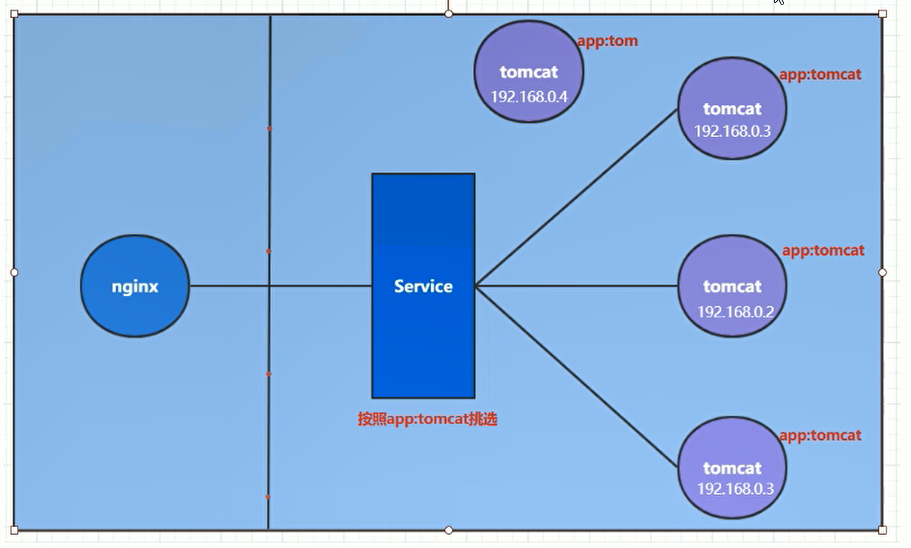
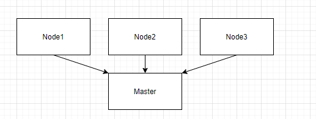
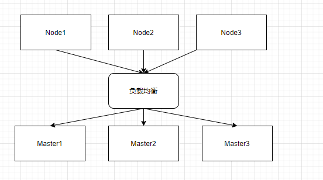

## K8s 介绍

**前置知识**

- `Linux`
- `Docker`

**K8s 介绍**

`Kunernetes`，简称 K8s，因为 K 和 s 之间有 8 个字符，所以简称 8。这是一个开源的，用于管理云平台中多个主机上的容器化的应用。

K8s 是 Google 开发的，在经过生产环境十几年的考验之后，不断完善，最终在 2014 年开源出来。

传统的应用部署方式方式通过插件或者脚本来安装应用，这样做的缺点是应用的运行、配置、管理、所有生存周期将与当前操作系统绑定，这样做并不利于应用的升级更新/回滚等操作，虽然可以通过虚拟机的方式来实现某些功能，但是虚拟机非常重，并不利于可移植性。

新的方式是通过部署容器方式实现，简单来讲就是带环境安装，让生产环境和测试环境保持一致，避免很多不必要的麻烦。

容器化部署，Docker 虽然也可以做，但是上限也就在大几百，一旦数量增多，Docker 也就有心无力了。K8s 支持自动化部署、大规模的升级/回滚操作，让部署的过程更加简洁方便。

**K8s 功能**0

- 自动装箱：自动完成，无需手动。
- 自我修复：当主节点挂掉之后，副节点会自动启动，启动并且自检之后对外提供服务。
- 水平扩展：高峰期可以自动扩展副本，高峰期过后会自动缩减副本。
- 服务发现：负载均衡。
- 滚动更新：应用加某几个服务之后，首先进行自检，检查之后没有问题对外提供服务。
- 版本回退：新的版本有 BUG，可以回退到上个版本。
- 密钥和配置管理：热部署，不需要重新构建镜像就可以更新配置。
- 存储编排：存储系统可以来自本地或者外部、云存储等。
- 批处理：支持一次任务、定时任务。

**K8s 集群架构组件**

Kubernetes 的本质其实是一组服务器集群，它可以在集群的每个节点上运行特定的程序，来对节点中的容器进行管理，目的是为了实现资源管理的自动化。

一个 Kubernetes 集群中的节点主要分为两大类：控制节点（master），工作节点（node），每一个节点上都会安装不同的组件。


- Master Node：主控节点（管理节点）。
    - API Server：集群控制的统一入口，各个组件的协调者。提供认证、授权、API 注册、发现等机制。
    - Scheduler：节点调度，选择工作节点应用部署。
    - Controller Manager：负责维护集群的状态，比如程序部署安排，自动扩展，滚动更新等。
    - ETCD：存储系统，用于保存集群中的相关数据。

    使用这样的方式干巴巴的，所以来举个例子作为说明。比如我想要在 Kubernetes 集群上运行一个服务 Nginx，那么：
    
    1. 首先跑到 API Server 这个入口中进入 Kubernetes 集群。
    2. Scheduler 去计算，去判断这个活应该交给哪个工作节点来做，比如最后算出来应该交给 Node1，然后交给 API Server 这个信息。
    3. Controller Manager 从 API Server 中得知，工作应该交给  Node1 来做，那么 Controller Manager 就去派活。
    4. 派活之后管理者应该有一个单子，里面列着谁干了什么活，那么这个就交给 ETCD 存储。

- Worker Node：工作节点（做事情的节点）。
    - Kubelet：Master Node 派到 Worker Node 的一个代表，管理当前节点的容器部分。
    - Kube-proxy：提供网络代理，利用它也可以实现负载均衡等操作。
    - Docker：节点上容器的各种操作。

    node 节点当然就是最后用来干活的节点，但是里面的组件也比较复杂，我们还是以刚才的例子来讲：
    
    1. 刚才说到，Controller Manager 将活派给了 Node1 节点，那么这个 Node1 节点应该有一个耳朵可以听，有能力可以进行任务分配，那么组件 Kubelet 就是干这个用的，Controller Manager 和 Kubelet 对接。
    1. Kubelet 也不干活，Kubelet 会将工作分配给 Docker 来干活，Docker 内部会启动一个有一个的 Pod，交给这些 Pod 去执行任务，Nginx 就运行在这些 Pod 上。
    1. Nginx 运行中，我们想要访问，就要通过 kube-proxy 来进行访问 Nginx。

:::tip
1. 以后如果单单提到 Master 指的就是 Master Node，如果单单提到 Node 指的就是 Worker Node。
2. master 中，Scheduler 只负责计算任务应该交给谁，分配任务是 Controller Manager 来负责的。
3. ETCD 只是 Kubernetes 集群自带的一个存储工具，完全可以自己配置为别的东西，比如 MySQL。
:::

:::tip
1. Kubelet 就相当于工地的工头，它本身不干活，是一个小任务的管理者。
1. 访问某一个具体的程序是通过 kube-proxy 来访问的，但是注意不要把它和 API Server 混淆了。
   
   API Server 是整个集群的控制节点，我们访问集群中的内容才通过 API Server 去访问。
   
   而 Kubelet 只是工作节点上运行的一个程序而已，本身我们没有访问集群中的组件，也没有进行集群控制，所以不需要使用 API Server。
:::

我们再以 Nginx 部署来说明 Kubernetes 各个组件的关系：

1. 首先明确，一旦 Kubernetes 集群启动之后，master 和 node 的信息都会存储到 etcd 数据库中。
1. 一个 Nginx 服务的安装请求首先会发送到 ApiServer上。
1. Scheduler 会来决定是将服务安装到什么 node 节点上，然后将结果告知给 API Server。
1. API Server 调用 Controller Manager，来安排工作给 node。
1. Kubelet 在 node 节点上等着接活，这个时候 Controller Manager 将工作内容交给了 Kubelet。
1. Kubelet 接受到了指令，会通知给 Docker，然后 Docker 会启动一个 Nginx 的 Pod。
1. Nginx 服务运行在了 Pod 上，假如想要访问这个服务，那么必须要通过 kube-proxy 来对 Pod 产生访问的代理。


:::tip
Pod 是 Kubernetes 的最小操作单元，容器必须跑在 Pod 中。
:::


**K8s 核心概念**

- Master：集群控制节点，每一个集群至少需要一个 master 节点负责管理集群。
- Node：工作负载节点，干活的节点。
- Pod：Kubernetes 中的最小控制单元。
- Controller：简单来讲就是用 Controller 对 Pod 管理，比如启动 Pod，关闭 Pod，伸缩 Pod 数量等。

    Pod 是最小的控制单元，但是我们一般不会直接操控 Pod，而是通过 Pod 控制器（Controller）来实现对 Pod 的控制。
    控制器在 Kubernetes 中不是一个概念，而是一类概念，控制器有很多种，每一种控制器都有它适合的场景。

- Service：Pod 对外服务的统一入口，下面可以维护同一类的多个 Pod。
- Label：用于对 Pod 分类，同一类的 Pod 拥有多个相同的 Label。
- NameSpace：隔离 Pod 的运行环境。

    在默认情况下，一个 Kubernetes 中的所有 pod 是可以相互访问的，但是我们可以通过配置 namespace 来隔绝 pod 之间的相互访问，或者做到某几个 pod 可以相互访问，其他的不行，等等。



在上图中，四个紫色的 tomcat 是在 pod 上启动的，service 作为 pod 提供服务的统一入口，用这个来实现负载均衡的效果。

在上图中可以看到，有两类标签：`app: tom`、`app: tomcat`，service 通过标签来将 pod 分类，维护了标签相同的 pod。


## 搭建 K8s 集群

### 先行介绍

**平台规划**

之前的内容中提到过，K8s 的两个节点：Master 和 Node，Node 肯定是多个的，那么就要看 Master。

所以我们有两个规划：*单 Master 集群*和*多 Master 集群*。





为了测试简单，我们使用一主两从的集群来作为测试环境的搭建。

**安装方式**

kubernetes 有多种部署方式，目前的主流方式有 minikube、kubeadm、二进制包：

- minikube：搭建单节点的 kubernetes 工具，这个我们不做考虑（我们要搭建的是集群）。
- kubeadm：快速搭建 kubernetes 的工具。
- 二进制包：从官网上下载每一个组件的二进制包，依次安装，这个对于理解 kubernetes 的组件更加有效。

我们现在使用的是 kubeadm 的方式来进行安装。

**主机规划**

| 作用   | IP 地址         | 配置                       |
| ------ | --------------- | -------------------------- |
| Master | 192.168.109.100 | 2 CPU，2 G 内存，50 G 硬盘 |
| Node1  | 192.168.109.101 | 2 CPU，2 G 内存，50 G 硬盘 |
| Node2  | 192.168.109.102 | 2 CPU，2 G 内存，50 G 硬盘 |

:::tip
主机规划时注意，选择软件安装时，选择基础设施服务器。
:::

### 主机环境初始化

#### 主机安装

1. 检查操作系统版本，CentOS 必须要在 7.5 上。

    ```shell
    cat /etc/redhat-release
    ```

1. 设置主机名的解析，编辑 `/etc/hosts` 文件，这是测试服务器，企业环境中一般使用 DNS 服务器做解析：

    ```shell
    192.168.109.100 master
    192.168.109.101 node1
    192.168.109.102 node2
    ```

1. 时间同步，Kubernetes 要求集群中的节点时间必须精确一致，这里直接使用 chronyd 服务从网络同步时间：

    ```shell
    systemctl start chronyd
    systemctl enable chronyd
    # 等待几秒，使用 date 来验证时间
    date
    ```

1. Kubernetes 和 Docker 在启动的时候会产生大量的 iptables 规则，为了不让系统规则和他们混淆，我们关闭系统规则，生产环境防火墙关闭一定要慎重：

    ```shell
    systemctl stop firewalld
    systemctl disable firewalld
    systemctl stop iptables
    systemctl disable iptables
    ```

1. 禁用 selinux，selinux 是一个 Linux 下的安全服务，假如不关闭，可能会产生一些奇葩问题，编辑 `/etc/selinux/config`：

    ```shell
    SELINUX=disabled
    ```

1. 禁用 swap 分区：
    
    swap 分区在 Linux 指的是虚拟内存分区，在物理内存满了之后，用磁盘空间当内存用。

    但是 swap 分区会对系统设备产生极其负面的影响，所以 Kubernetes 要求每一个节点都要禁用 swap 设备，假如实在关不掉，在启动集群的时候就要明确指定参数配置。

    编辑 `/etc/fstab`，编辑完成之后重启 Linux：

    ```shell
    # /dev/mapper/centos-swap swap                    swap    defaults        0 0
    ```

1. 修改 Linux 内核参数：

    为 Linux 添加网桥过滤和地址转发功能，修改 `/etc/sysctl.d/kubernetes.conf`：

    ```shell
    net.bridge.bridge-nf-call-ip6tables = 1
    net.bridge.bridge-nf-call-iptables = 1
    net.ipv4.ip_forward = 1
    ```

    重新加载配置：`sysctl -p`

    ```shell
    # 网桥过滤
    modprobe br_netfilter
    # 查看是否加载成功
    lsmod | grep br_netfilter
    ```

1. 配置 ipvs 功能

    kubernetes 中和 service 中有两种代理模式：iptables 和 ipvs，ipvs 的性能高，需要手动载入。

    ```shell
    yum -y install ipset ipvsadmin
    ```

    ```shell
    cat <<EOF > /etc/sysconfig/modules/ipvs.modules
    #!/bin/bash
    modprobe -- ip_vs
    modprobe -- ip_vs_rr
    modprobe -- ip_vs_wrr
    modprobe -- ip_vs_sh
    modprobe -- nf_conntrack_ipv4
    EOF
    ```

    ```shell
    # 增加可执行权限，之后执行
    chmod +x /etc/sysconfig/modules/ipvs.modules
    # 查看是否加载成功
    lsmod | grep -e ip_vs -e nf_conntrack_ipv4
    ```

1. 重启 Linux，检查 selinux 和 swap 分区情况：

    ```shell
    # 应该为 disable
    getenforce
    # swap 应该全是 0
    free -m
    ```

#### 环境安装

下面主要做的内容就是：在三台服务器中安装 Docker（18.06.0）、kubeadm（1.17.4）、kubelet（1.17.4）、kubectl（1.17.4）。

**安装 Docker**

```shell
# 切换镜像源
wget https://mirrors.aliyun.com/docker-ce/linux/centos/docker-ce.repo -O /etc/yum.repos.d/docker-ce.repo

# 查看当前镜像源中支持的 docker 版本
yum list docker-ce --showduplicates

# 安装指定版本的 docker-ce，必须指定 --setopt=obsoletes=0，否则 yum 会安装更高的版本
yum -y install --setopt=obsoletes=0 docker-ce-18.06.3.ce-3.el7

# 添加一个配置文件，docker 在默认情况下使用的 Cgroup Driver 为 cgroupfs，而 kubernetes 推荐使用 systemd 来替代 cgroupfs，并且切换一下国内的仓库镜像
mkdir /etc/docker
cat <<EOF > /etc/docker/daemon.json
{
  "exec-opts": ["native.cgroupdriver=systemd"],
  "registry-mirrors": ["https://kn0t2bca.mirror.aliyuncs.com"]
}
EOF

# 启动 docker
systemctl start docker

# 查看 docker 版本是否为我们指定的版本
docker version

# 设置 docker 为开机自启动
systemctl enable docker
```

**安装 kubernetes 组件**

```shell
# 切换为国内镜像源，编辑文件 /etc/yum.repos.d/kubernetes.repo，添加如下配置
[kubernetes]
name=Kubernetes
baseurl=http://mirrors.aliyun.com/kubernetes/yum/repos/kubernetes-el7-x86_64
enabled=1
gpgcheck=0
repo_gpgcheck=0
gpgkey=http://mirrors.aliyun.com/kubernetes/yum/doc/yum-key.gpg
       http://mirrors.aliyun.com/kubernetes/yum/doc/rpm-package-key.gpg

# 安装 kubeadm、kubelet、kubectl
yum -y install --setopt=obsoletes=0 kubeadm-1.17.4-0 kubelet-1.17.4-0 kubectl-1.17.4-0

# 配置 kubelet 的 cgroup，编辑 /etc/sysconfig/kubelet（之前的内容都删掉），添加如下配置（需要改变 cgroupfs 为 systemd，并且改变代理模式为 ipvs，之前说过 ipvs 性能高）。
KUBELET_CGROUP_ARGS="--cgroup-driver=systemd"
KUBE_PROXY_MODE="ipvs"

# 设置 kubelet 开机自动启动（这个我们不用启动，因为后面集群启动会自动启动这个东西）
systemctl enable kubelet
```

**安装 kubernetes 组件**

首先我们一定要有一个清晰的认知：搭建 kubernetes 集群其实就是安装 kubernetes 组件。

:::tip
p9 doing
:::