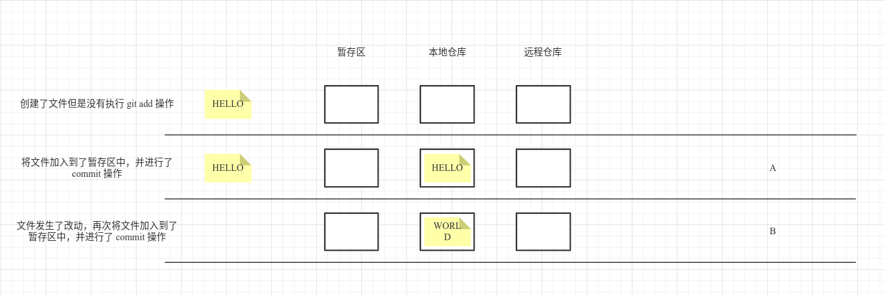
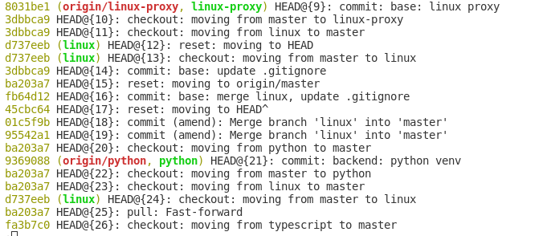

## 说明

本文档目前的部分来自 [Oh Shit，Git？](https://ohshitgit.com/zh)，部分来自之前的笔记，日后有比较好用的操作也会放进来。

## Git 分区

在 Git 中，有几种分区：工作区、暂存区、本地仓库、远程仓库。我们用一个文件来说明这三种分区情况：

1. 一个文件被创建了，这个时候文件在工作区中，也就是你能够在屏幕前看到的代码。它还不被 Git 管理，所以在 Git 上，它是一个未追踪的状态。
1. 使用 `git add xx` 命令，将这个文件的当前内容添加到 Git 中，这个时候文件就会被 Git 管理，这个时候是放到了 Git 的暂存区中，这个时候文件是已经追踪，但是没有提交的状态。
1. 使用 `git commit` 命令，就会将文件的当前内容从暂存区中挪动到本地仓库中，这个时候文件是已经提交的状态。
1. 可能文件发生了改动，那么这个时候因为发生了改动，Git 会检测到，那么文件当前的状态就变成了文件发生改动的状态。

    注意，在此时 Git 已经有了上一次文件的全部内容，但是没有这次文件的内容。

1. 再次使用 `git add`，那么文件当前的状态就会再次被 Git 追踪，添加到了暂存区中。
1. 再次使用 `git commit`，文件当前的状态就会被放到本地仓库中。

    注意，此时的本地仓库中一共有两次提交，第一次提交是文件没有发生改动之前的状态，第二次提交是文件发生改动之后的状态。
1. 使用 `git push` 命令，文件就会从本地仓库上传到远程仓库，这个时候文件的所有 commit 都会 push 上去。

## Git 常用操作

**git 回滚**

在上图的例子中，Git 进行了两次 commit，它们的编号分别为 A、B。

回滚其实就是对于 Git 几个分区的管理：

- `git reset`：默认使用 `git reset --mixed` 方式回滚。
- `git reset --soft`：仅仅将本地仓库回滚，工作区和暂存区保持不变，也就是回到你没有进行 commit 之前的状态。
- `git reset --mixed`：回滚本地仓库和暂存区中的代码，工作区保持不变，也就是回到你没有进行 add 之前的状态。
- `git reset --hard`：回滚本地仓库、暂存区、工作区中的代码，也就是回到你没有更改代码之前的状态。
- `git reset --keep`：回滚本地仓库、工作区中的代码，暂存区保持不变。这个一般用得少。

**查看当前所有的 commit**

`git reflog` 操作可以查看当前所有的 commit，包括所有的分支，所有已经被删除的 commit。这个操作可以在某些特定的时间吃一颗后悔药。

效果如上图，可以清晰地看到每一个分支的提交情况，然后就可以再调用 `git reset HEAD@{index}`，就可以回到对应的位置了。

**覆盖本地上次的 commit 操作**

当你 commit 了之后，可能就会发现自己还有需要改动的地方，这个时候假如为了一丁点的小改动再次提交一个 commit 就显得太难看了。

`git commit --amend` 可以让你去覆盖上一次 commit 内容，做到推送到远程时，只会有一条 commit 信息。

`git commit --amend` 会重新让你去编辑 commit 的信息，假如你不想重新编辑信息，使用 `git commit --amend --no-edit`

:::tip
注意，这种操作不要对刚刚拉下来的分支做，因为远程分支的内容是上一次提交的内容，你在上一次的提交上进行 `amend` 操作，相当于覆盖了上次的提交。

上次的提交甚至有可能不是你做的，是别人做的。
:::

**直接提交到了 master 上的内容再切到新的分支**

有这样一种情况：本来应该是放到一个新的分支上的内容，却由于忘记切换分支，直接提交到了 master 上。

第一种解决方式：

1. `git branch new-branch`：首先从当前的 master 分支上切出一个新的分支。
1. `git reset HEAD~ --hard`：master 节点直接强制回滚到上次提交的位置，使用 hard 会将所有内容强制回滚到之前。
1. `git checkout new-branch`：切到新的分支。

第二种解决方式：

1. `git checkout new-branch`：首先切换到新的分支。
1. `git cherry-pick master`：抓取 master 节点最后一个 commit 到当前分支下。
1. `git checkout master`：切回 master。
1. `git reset HEAD^ --hard`：强制回滚到之前的 commit。

:::tip
这种方式只能在没有提交到远程分支的时候使用，不过一般来讲 master 分支是受保护的，一般人推不上去，有权限的推上去只能 revert 了。
:::

**查看保存在暂存区中的改动**

`git diff` 命令可以查看当前的代码与之前的 commit 有什么改动，但是使用 `git add` 工具之后要使用 `git diff --staged` 来查看。

**撤回某一个文件的改动**

假如现在提交的某一个文件发现不对，那么回滚整个项目明显是不正常的，可以通过 `git checkout [回滚的 hash 值] -- path/to/file`。

使用 checkout 来回滚某一个文件，这操作也太渣了……

**干掉某一个分支上的所有未追踪的文件**

1. `git fetch origin`：获取远程的最新状态，使用 master 来举例。
1. `git checkout master`
1. `git reset origin/master --hard`
1. `git clean -d --force`：干掉所有未追踪的文件和目录。
