## Linux 入门

**Linux 是什么**

Linux是一个操作系统，它免费、开源、稳定、安全、可以处理高并发。

常见的操作系统：
windows、IOS、Android、MacOS、Linux、Unix

目前很多企业级项目都会部署到Linux上

---

**Linux 吉祥物**

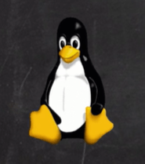

Tux，是一只企鹅。

---

**Linux 之父**

Linus Torvalds，也是 Git 创始者。世界著名黑客。

---

**Linux在什么情况下会使用**

1. Linux 下面开发项目会使用到：
   - JavaEE
   - 大数据
   - Python
   - PHP
   - C/C++
   - Go
1. Linux 运维工程师。
1. Linux 嵌入式工程师。

**Linux应用的领域**

1. 个人桌面领域。
1. 服务器：在服务器端是最强的。
1. 嵌入式领域。
    因为Linux的内核可以进行裁剪，最小可以达到几百KB，所以很轻松就可以移植到嵌入式领域去。
    机顶盒、数字电视、网络电话、手机、PDA、智能家居等等都是它应用的领域。以后在物联网中，应用会更加广泛。

---

**最新版的Linux内核**
可以看到最新版本的稳定版：[网址](https://www.kernel.org/)。

---

**Linux 主要的发行版**
Ubuntu、RedHat、CentOS、Debain、Fedora、SuSE、OpenSUSE。

Linux的发行版和Linux的关系：
Linux主要指的是一个内核，而在这个内核的基础上有很多人对它进行包装，然后形成不同的发行版。这些发行版的内核可能是一样的，只不过是包装不同而已。

---

**Linux 和 Unix 的关系**

Unix 也是一个操作系统。在上世界70年代，贝尔实验室、麻省理工、通用电气要做一款多用户、分时的操作系统，并且命名为 Multics，但是没有成功。后来 ken tompsom 根据这个开发出了 Unix，开始是 B 语言写的（B 语言也是他写的，GO 也是他写的）。

后来 ken tompsom 和 Dennis richres 联手用 C 语言改写了 Unix（C语言是他们两个共同创造的）。

到了上世纪80年代，IBM、SUN、HP（惠普）进行了二次开发，但是他们发现 Unix 只能运行在大型项目中，一般的电脑装不起来，所以Richard Stallman（号称世界第一黑客）提出了一个观点：

- 在自由时代，用户应该享有对软件源代码阅读、修改的权力。
- 软件公司可以靠提供服务、训练来盈利。

根据这个观点，他发起了一个 GNU 计划，对 IT 领域产生了巨大的影响。这个计划简单来讲，是可以阅读并修改别人的源码并提交，对某个项目做贡献。
Linus Torvalds 参加了 GNU 计划，贡献出了 Linux Kernel 这个内核，有很多人就根据这个内核进行升级维护。所以 Linux的全名应该叫做：GNU/Linux。

至于 Linux 和 Unix 的关系，Unix 被别人二次开发之后有很多二次发行版，那么 Linus 就选择了一个比较小巧的、功能也不弱的发行版：Minix，根据 Minix 的基础上进行重新改写，形成了 GNU/Linux 内核。它的一个重大突破是适用于 X86 的个人计算机。于是有公司就根据这个 GNU/Linux 内核开发出了不少发行版，比如 Ubuntu，Redhat，SUSE，Fedora 等。而Redhat又衍生出CentOS（社区版）和redhat（企业版）。

---

## VM和Linux的安装

学习Linux需要一个环境，我们需要创建一个虚拟机，然后在虚拟机上安装一个CentOS来学习（或者可以直接在真机上安装一台Linux）

步骤：

1. [Virtual Machine 15.5](https://www.nocmd.com/windows/740.html)。

1. [LInux（CentOS 7.5）](http://mirrors.163.com/centos/)，下载版本为 `7.6.7810` 和 `8.1.1911` 版本，或者有一台云服务器也可。

1. 新建虚拟机：
	打开VM，选择新建虚拟机-->典型-->稍后安装操作系统-->Linux（选择版本选择红帽7）-->切换目录-->先给20G，拆分为多个文件-->内存按照它的推荐（这个先记住，等会用），处理器按照真机的CPU数量给，CPU的内核给真机内核的一半-->网络适配器选NAT-->关闭。

	

	CentOS本来就是红帽家族的产品，所以选择红帽即可。

1. 右键新添加的 `CentOS-->CD/DVD-->使用ISO镜像文件`。

1. 打开虚拟机，选择 Install。

	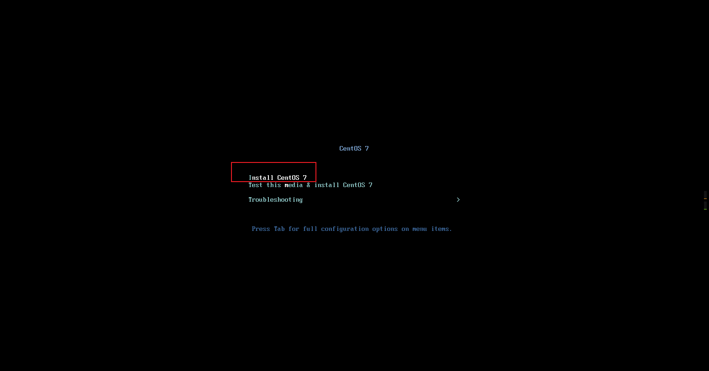

1. 语言选择中文，下一步，然后开始等待，一定要等待，否则乱点可能会卡死。

1. 软件选择：

   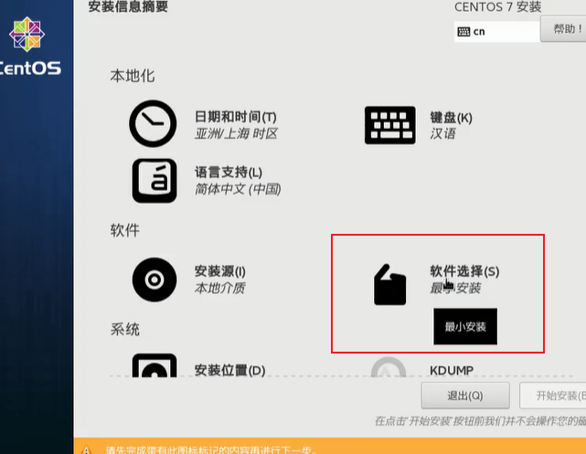

   最小安装是不带界面的，这不利于我们学习，但是在实际工作中可以选择。

1. 软件选择界面选择如下：

   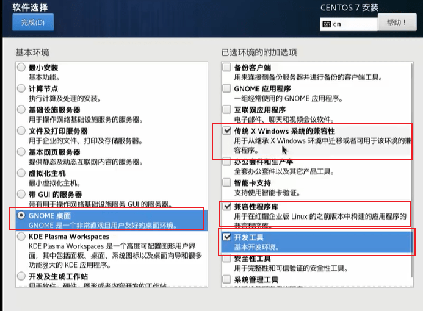

	选择开发工具后，我们默认的GCC，JDK，MYSQL等都默认装上了，以后不想用它的也可以自己更改，然后点击完成。点击完成之后，等待，鼠标乱点可能会导致卡死
	安装位置：

	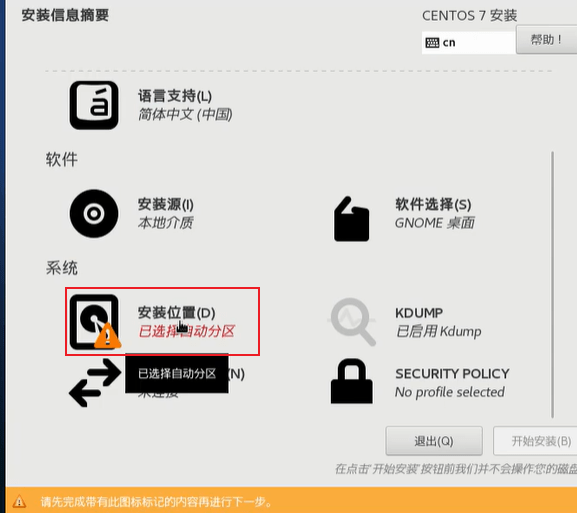

1. 安装位置选择：

	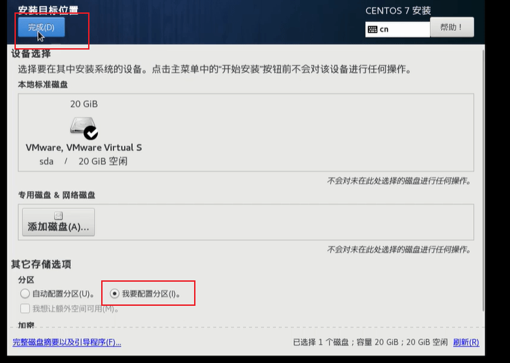

1. 分区设置：
	Linux我们一般分为三个部分：
	- boot分区，也叫引导分区。
	- swap分区，也叫交换分区。
	- 根分区。

	三者大小设置一般来说，boot分区一般给1G即可，交换分区和分配的内存大小一致，也就是我们在一开始定义硬件部分的内存大小设置，这里定义了2G，剩下的都是根分区的。
	boot分区：引导分区。

	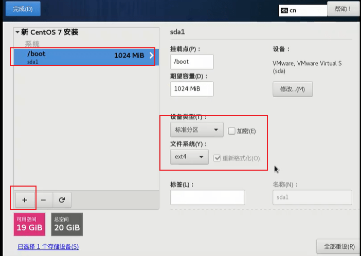

	swap分区：就是可以临时充当内存，比如现在内存里塞了三个程序，塞不下了，那么第四个程序可以临时到swap分区，等到前面三个程序执行完成之后才会放到真实内存中。但是它毕竟是虚拟内存，速度不如真实内存

	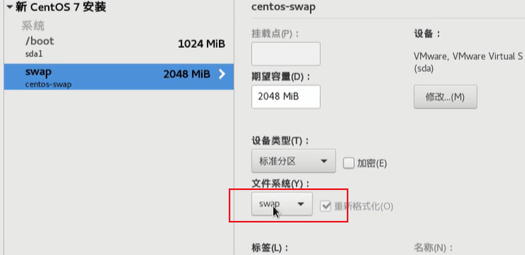

	根分区。

	

	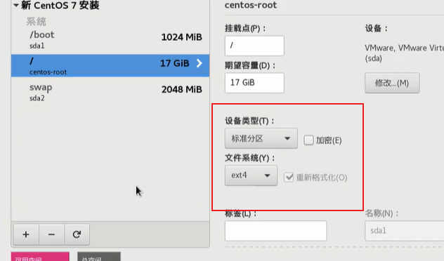

1. KDUMP：
	KDUMP是一个内核崩溃的转存机制，就是保护你的系统用的，但是这个会占用一部分内存，真正的生产环境要选择，但是在学习过程中就不需要了

	

	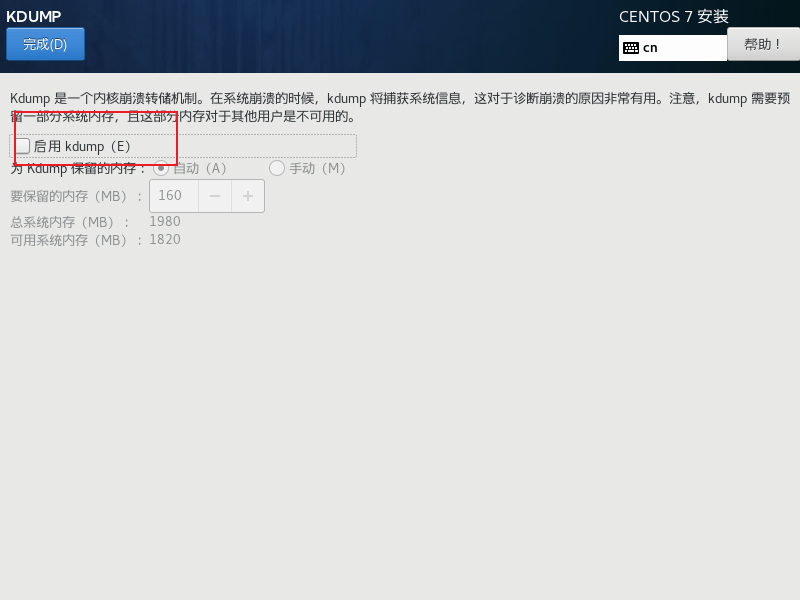

1. 网络和主机名：

	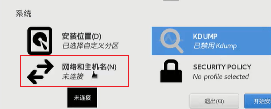

	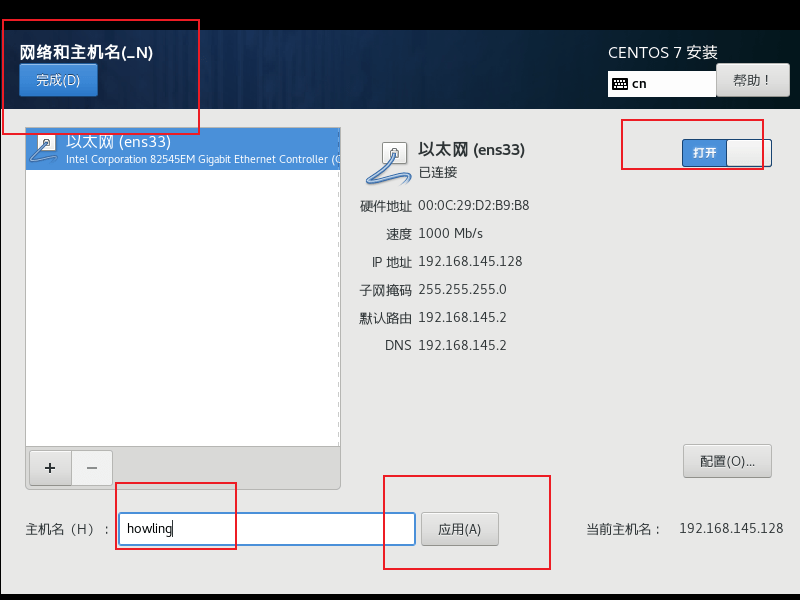

1. 安全策略

	

	这个安全策略可以不应用，比如在设置用户名密码的时候有些要求

	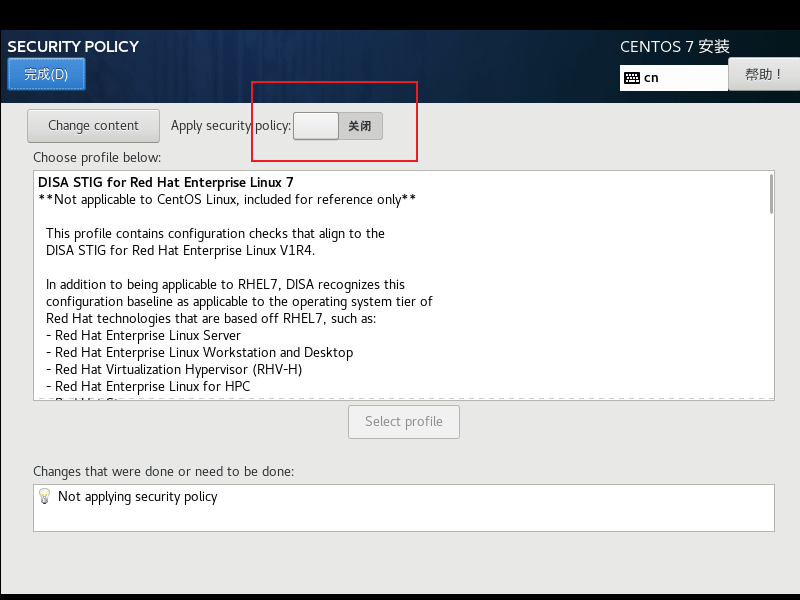

1. 安装，设置密码：

	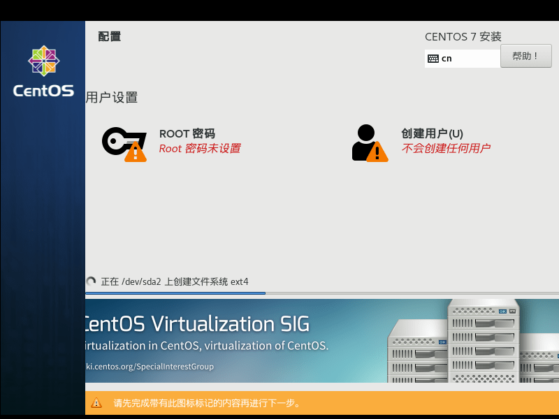

	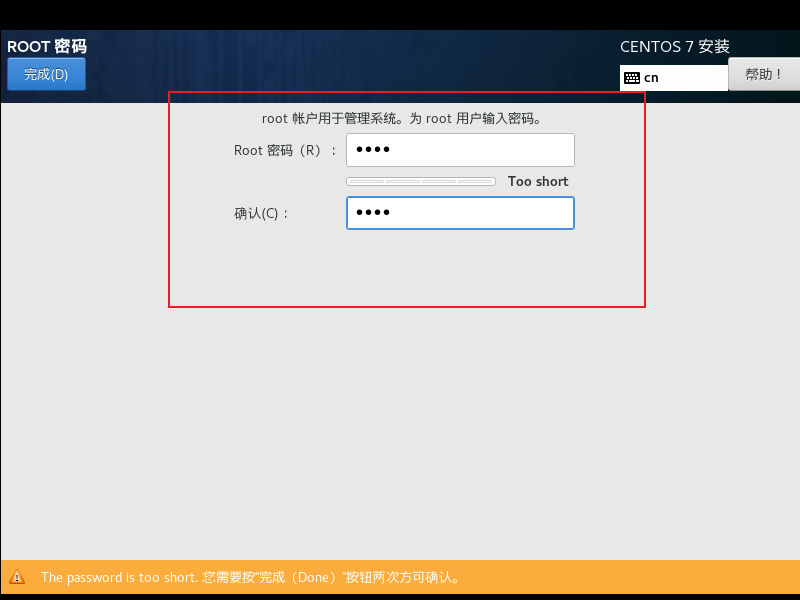

	在实际工作中，密码一定要复杂一些，这里设置了 `root` 为密码。

1. 创建用户：
	一般来说，Linux建议我们再用一个权限比较低的用户作为登陆，而Root用户也可以，但是建议再弄一个。

	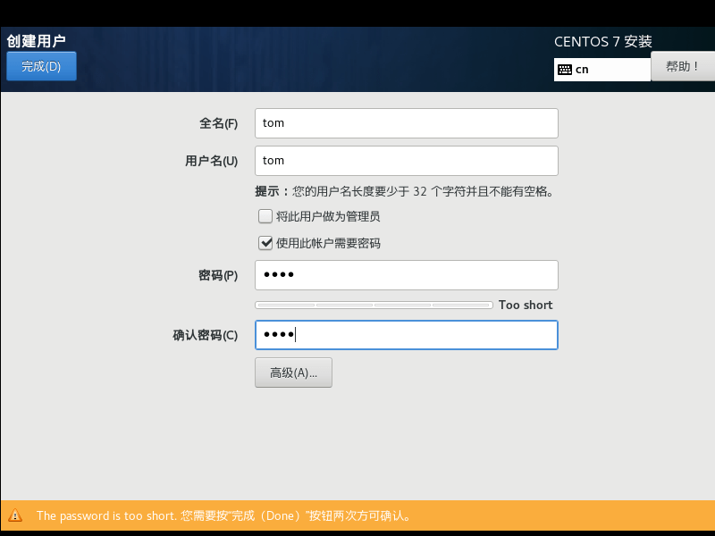

	密码仍是root。
1. 安装成功，点击重启，同意许可证，我们可以使用非root用户登陆，也可以使用root用户登陆。

---

## Linux基本概念介绍

### Linux网络链接的三种方式的区别

在刚才我们安装CentOS的时候曾经选择过网络，那里有几种方式：

- 桥接模式。
- NAT 模式。
- 仅主机模式。
- 自定义。
- LAN区段。

下面我们说一下几种模式的区别。

---

**桥接模式**

它可以令Linux能够和外部进行通讯，只需要Linux和外部的主机在同一个网段下即可。

比如现在张三有主机A，虚拟机B，王五有主机C，虚拟机D，网关为 `255.255.255.0`。
这个时候张三的主机是 `192.168.0.20`，虚拟机是 `192.168.0.80`，所以张三的主机和虚拟机都是在一个网段下。
那么王五的主机是 `192.168.0.30`，它们三者共同在一个网段下，张三的虚拟机就可以直接和王五的主机通信。

但是这种方式有可能回造成冲突，比如一个教室里面 300 个人，但是网段只有 255，那么肯定就会产生冲突。
但是在这种模式下，A 可以找 C，C 也可以找 A。

**NAT模式**

假如现在张三的主机A、B，王五有主机C
A 的 ip 为 `192.168.0.20`，B 的 ip 为 `192.168.100.88`，C 的 ip 为  `192.168.0.30`。

那么这个时候，看似张三的 Linux 和另外两个不在同一个网段，但是在 NAT 模式下一切皆有可能：张三的主机 A 会生成一个对应的网卡，和 Linux 在同一个网段下，比如 `192.168.100.99`。那么 B 就可以和 A 进行互通，并且 B 可以根据 A 作为一个跳板去通信 `192.168.0.xx` 频段的内容。

所以 NAT 模式就是我们说的网络地址转换模式，不造成 IP 冲突，但是这个时候虚拟的 B 可以和外部进行通信。但是这个时候注意，外部不能去访问内部的，也就是 C 不能找 B。

**主机模式**

不和外部进行通讯

---

### 虚拟机克隆

**方式一**

直接拷贝一份安装好的虚拟机文件。

**方式二**

使用 VMWare 的克隆操作：
注意，在克隆之前要先关闭 Linux。

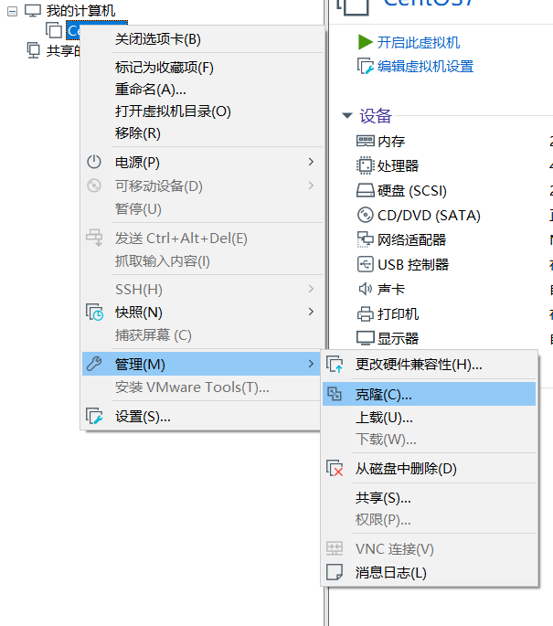

---

### 虚拟机快照、迁移和删除

**快照**

假如我们拍摄了快照B，然后拍摄了快照A，那么假如想从虚拟机的状态A回滚到状态B，那么直接可以使用快照回滚

如果想再次回到快照A，也可以使用回滚

但是注意，快照会占用虚拟机的空间

**虚拟机的迁移和删除**

我们可以将虚拟机的整体文件拷贝到别的地方，这就是迁移。假如我们要删除文件夹，那么就直接删除即可

---

### VMTools

VMTools可以让我们在Windows下面更好地管理VM虚拟机，可以设置windows和centos的共享文件夹。
安装VMTools有如下步骤：

1. 进入 centos，注意首先需要 GCC，只需在终端输入 `gcc -v` ，假如安装了会输出相关信息，没安装会找不到。
1. 点击 vm 菜单中的 install vmware tools。
1. centos 会出现一个 `xxx.tar.gz`。
1. 拷贝到 `/opt`。
1. 使用解压命令 `tar -zxvf xxx`，得到一个安装文件夹。

	

1. 进入解压的目录。
1. 安装 `./vmware-install.pl`。
1. 全部使用默认设置。
1. 点击当前 centos 的 `设置-->共享文件夹-->选择`。

	

	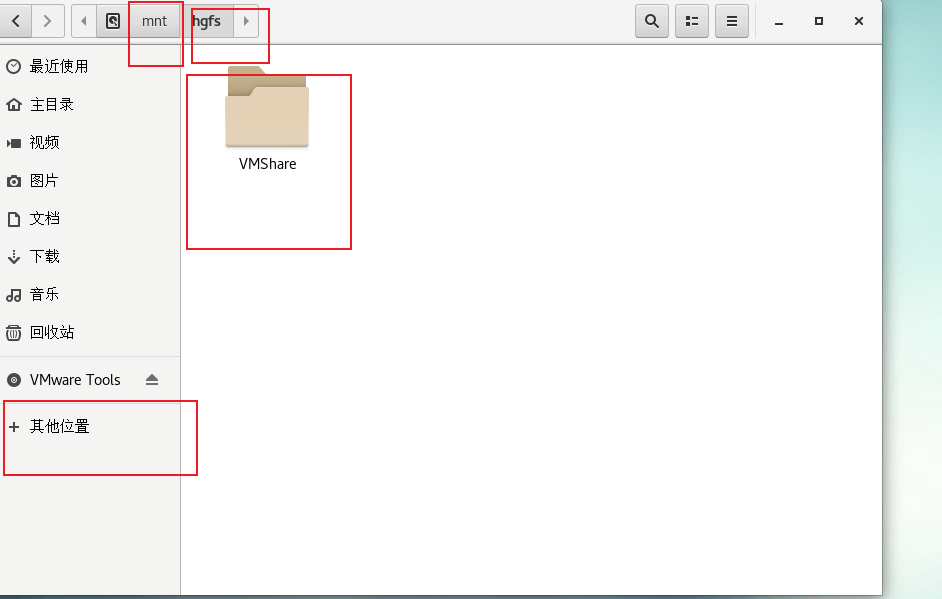

## Linux目录结构

**基本概述**

1. Linux 中的文件系统是采用层级结构的树状目录结构，最上层是 `/` 根目录，然后在此目录下再创建其他的目录。
	注意，这些目录的作用都是规定好的，不能更改。
1. 在Linux中，一切皆文件。
	之所以号称一切皆文件的原因是它会将所有的硬件都转换成文件来进行显示，CPU、硬盘，甚 U 盘。

---

**一定要背这种主体的结构，起码常用的要知道啥意思**，我们讲的都是根目录之下的目录结构：

- `/bin`：常用，是 Binary 的缩写
	这个目录下存放着最常用的命令，除了这个目录还有 `/usr/local/bin` 和 `/usr/bin`，也存放一些命令。
- `/sbin`：常用，管理员指令，权限比较高的指令。
- `/home`：常用，是普通用户的存放主目录，在 Linux 中，每一个用户都有一个自己的目录，这个目录名称一般是以用户的账号命名，比如我们刚才的 tom。
- `/root`：常用，为系统管理员的主目录。
- `/etc`：常用，所有的系统管理所需要的配置文件和子目录，比如 MySQL 数据库的 my.conf 和系统配置。
- `/usr`：常用，非常重要，用户的很多应用程序和文件都会放到这个目录下，类似 windows 的 program。
- `/boot`：常用，存放 Linux 启动时的一些核心文件，包括一些连接文件和镜像文件。
- `/media`：常用，Linux 会识别一些设备，比如 U 盘，光驱等，识别之后会把别的设备挂在到这个目录下。
- `/mnt`：常用，为了让用户临时挂载别的文件系统，我们可以将外部的存储挂在到这里，比如我们上面的 VMTools 共享文件夹。
- `/local`：常用，另一个给主机额外安装软件所安装的目录，一般是通过编译源码方式安装的程序。
	注意，这里是安装到这个目录，而且是源码编译安装，比如我要编译安装 Redis，那就可以这么用。
- `/var`：常用，存放一些不断扩充的东西，习惯将被经常修改的目录放在这个目录下，比如各种日志文件。

---

- `/dev`：类似设备管理器，所有的硬件文件都会以文件的形式存储在这里。
- `/opt`：给主机额外安装软件摆放的目录。
	注意是安装文件而不是安装到这里，比如要安装 IDEA，就把安装包先拷贝到这里。
- `/tmp`：临时文件目录。
- `/lost+found`：一般是空的，但是当系统非法关机后，就会存放一些文件，但是这个目录找不到，因为它隐藏了，要在控制台看。

---

- `/lib`：系统开机所需要的最基本的动态链接共享库，类似 Windows 里面的 DLL 文件，几乎所有的应用程序都需要这些共享库。
- `/proc`：一个虚拟目录，是系统内存的映射，访问这个目录来获取系统信息。
- `/srv`：service 的缩写，存放一些服务启动之后需要提取的数据。
- `/sys`：Linux2.6 内核的一个很大变化，在 2.6 内核中出现的一个文件系统 sysfs。

**以上四个别动，否则很可能造成系统崩溃。**

---

- `/selinux [security-enhanced linux]`：是一种安全子系统，它能控制程序只能访问特定文件，有三种工作模式，可自行设置。
