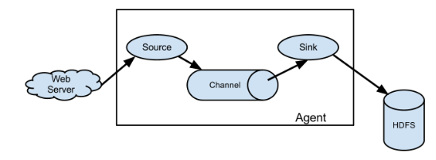
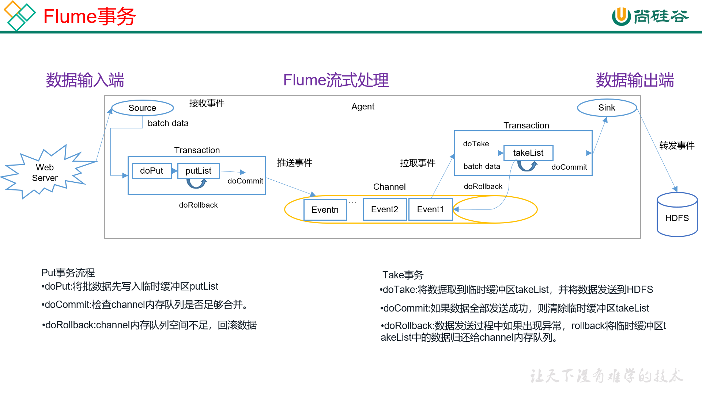
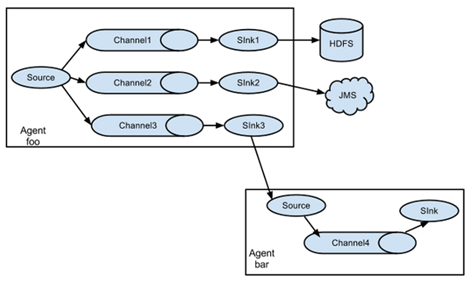
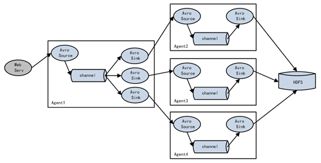
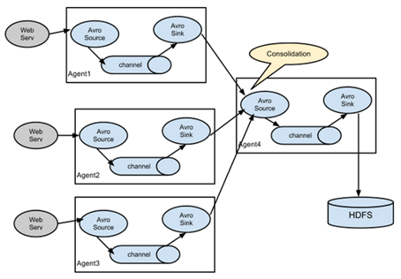
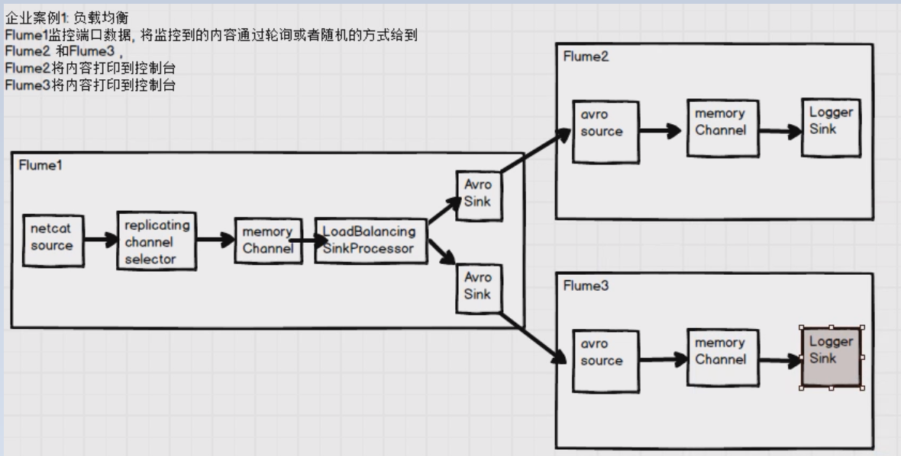
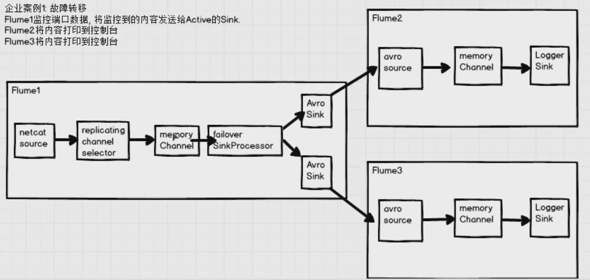
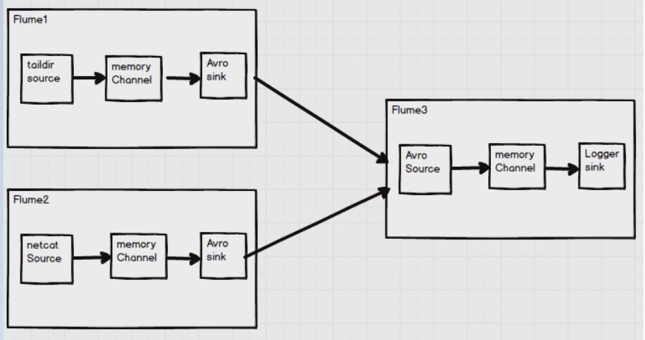

## Flume 概述

Flume，是一个日志采集系统，Cloudera 提供，是高可用的、高可靠的、分布式的，海量日志采集、聚合、传输的系统。Flume 流式架构，灵活简单。

Flume 可以从多个渠道获取内容，写入到多种渠道。


## Flume 基础架构



**Agent**

一个 JVM 进程，主要由 Source、Channel、Sink 组成。它会将数据以事件的方式从源头送到目的地。

**Source**

主要负责从源头将数据接受，Source 组件可以处理多种格式的数据，比如 avro、thrift、exec、jms、spooling directory、netcat、taildir、sequence generator、http、legacy 等。

**Channel**

主要用于传输，将数据源中的数据传送到目的地。可以看成是一个缓冲区，因此 Channel 允许 Source 和 Sink 运送在不用的速率上。

Channel 线程安全，可以同时处理几个 Source 的写入和几个 Sink 的读取。

**Sink**

Sink 位于 Agent 的消费端。它不断轮询 Channel 中的事件并且批量移除它们，并且将这些事件写入到存储中，或者发送到下一个 Flume Agent。

Sink 的目的地有：HDFS、Logger、avro、thrift、ipc、file、HBase、solr、自定义等。

**Event**

Flume 中，数据传输的最小单元。包含 Header 和 Body 两部分，Header 为 kv 结构，存放一些属性。Body 存放一些数据，形式是字节数组。


## Flume 开始

### 安装部署

1. [官网](http://flume.apache.org/)，下载 `apache-flume-1.9.0.tar-gz` 即可。
1. 上传到服务器 `/opt/software`，解压到 `/opt/module`。
1. 配置环境变量。
1. 如果安装了 Hadoop，需要删除 lib 包下的 `guava-11.0.2`，兼容 `Hadoop3.1.3`。

### 入门案例

**监听端口**

1. 思路：监听端口 44444，收集此端口的数据，并且打印到控制台中。
1. 安装 `netcat`，此工具可以用于向端口发送数据：`yum -y install nc`
1. 判断 44444 是否被占用：`sudo netstat -lnp | grep 44444`
1. 在 Flume Agent HOME 目录下创建 job 文件夹，并且进入。
1. 创建配置文件 `flume-netcat-logger.conf`，以下配置来自官方[手册](https://flume.apache.org/FlumeUserGuide.html)

    :::details 监控端口
    ```properties
    # Name the components on this agent
    # r1：a1 的 source 名称
    a1.sources = r1
    # k1：a1 的 sink 名称
    a1.sinks = k1
    # c1：a1 的 channel 名称
    a1.channels = c1

    # Describe/configure the source
    # a1 的输入源为 netcat
    a1.sources.r1.type = netcat
    # a1 监听主机
    a1.sources.r1.bind = localhost
    # a1 监听端口号
    a1.sources.r1.port = 44444

    # Describe the sink
    # a1 输出类型为控制台 logger
    a1.sinks.k1.type = logger

    # Use a channel which buffers events in memory
    # a1 的 channel 类型为内存
    a1.channels.c1.type = memory
    # a1 的 channel 总容量为 1000 个 event
    a1.channels.c1.capacity = 1000
    # a1 的 channel 传输时收集到了 100 条 event 之后再去提交事务
    a1.channels.c1.transactionCapacity = 100

    # Bind the source and sink to the channel
    # source r1 和 channel c1 连接
    a1.sources.r1.channels = c1
    # channel c1 和 sink k1 连接
    a1.sinks.k1.channel = c1
    ```
    :::

1. 开启 flume，监听端口：

    ```bash
    # 方法一：
    bin/flume-ng agent --conf conf/ --name a1 --conf-file job/flume-netcat-logger.conf -Dflume.root.logger=INFO,console
    # 方法二：
    bin/flume-ng agent -c conf -n a1 -f job/flume-netcat-logger.conf -Dflume.root.logger=INFO,console
    ```

    - `--conf/-c`：配置文件存储在 `conf/` 下。
    - `--name/-n`：给 agent 起名。
    - `--conf-file/-f`：本次 flume 启动时执行的读取的配置文件时使用的文件。
    - `-Dflume.root.logger=INFO,console`：`-D` 表示 flume 运行时动态修改 `flume.root.logger` 参数属性值，并且将级别改为 `INFO`（日志级别：`LOG、INFO、WARN、ERROR`）。

1. netcat 向本机 44444 发送内容：`nc localhost 44444`，之后便可以发送内容。
1. 结果：

    

    

**监听单个文件**

监控 Hive 日志，并且上传到 HDFS 中。

1. Flume 需要 Hadoop 相关的 jar 包才可以进行此操作。检查 Hadoop 和 Java 环境变量配置。
1. 在 job 文件夹下创建 `flume-file-hdfs.conf` 文件

    由于 Hive 日志在 Linux 中，所以读取文件需要按照 Linux 的规则来，下方 `exec` 指的是 `execute` 执行，表示执行 Linux 命令。

    对于所有和时间相关的转义序列，Event Header 必须含有时间戳，也就是以 timestamp 的 key（除非 `hdfs.useLocalTimeStamp` 设置为 true，也就是使用本地时间）。

    :::details 监控文件
    ```
    # 定义 source、sink、channel
    a2.sources = r2
    a2.sinks = k2
    a2.channels = c2

    # 定义 source 类型为执行命令，命令为 tail -F /opt/module/apache-hive-3.1.2-bin/logs/hive.log
    a2.sources.r2.type = exec
    a2.sources.r2.command = tail -F /opt/module/hive/logs/hive.log

    a2.sinks.k2.type = hdfs
    a2.sinks.k2.hdfs.path = hdfs://hadoop102:8020/flume/%Y%m%d/%H
    # 上传文件的前缀
    a2.sinks.k2.hdfs.filePrefix = logs-
    # 是否按照时间滚动文件夹
    a2.sinks.k2.hdfs.round = true
    # 多少时间单位创建一个新的文件夹
    a2.sinks.k2.hdfs.roundValue = 1
    # 重新定义时间单位
    a2.sinks.k2.hdfs.roundUnit = hour
    # 是否使用本地时间戳
    a2.sinks.k2.hdfs.useLocalTimeStamp = true
    # 积攒多少个 Event 才 flush 到 HDFS 一次
    a2.sinks.k2.hdfs.batchSize = 100
    # 设置文件类型，可支持压缩
    a2.sinks.k2.hdfs.fileType = DataStream
    # 多久生成一个新的文件
    a2.sinks.k2.hdfs.rollInterval = 60
    # 设置每个文件的滚动大小
    a2.sinks.k2.hdfs.rollSize = 134217700
    # 文件的滚动与 Event 数量无关
    a2.sinks.k2.hdfs.rollCount = 0

    # 缓冲区类型、大小
    a2.channels.c2.type = memory
    a2.channels.c2.capacity = 1000
    a2.channels.c2.transactionCapacity = 100

    # 绑定 source、channel、sink
    a2.sources.r2.channels = c2
    a2.sinks.k2.channel = c2
    ```
    :::

1. 运行 flume：`bin/flume-ng agent -c conf -n a2 -f job/flume-file-hdfs.conf -Dflume.root.logger=INFO,console`

    如果报错 `Exception in thread “SinkRunner-PollingRunner-DefaultSinkProcessor“ java.lang.NoSuchMethodError`，可以将 `$HADOOP_HOME/share/hadoop/common/lib` 下的 `guava-27.0-jre.jar` 覆盖 `$FLUME_HOME/lib` 的低版本 guava

1. 开启 Hadoop 和 Hive
1. 在 HDFS 上查看文件

**监控目录下多个文件**

1. 创建 `job/flume-dir-hdfs.conf`

    :::details 监控目录下多个文件
    ```
    # 定义 source、channel、sink
    a3.sources = r3
    a3.sinks = k3
    a3.channels = c3

    # spooldir：定义 source 类型为目录，spoolDir：给定目录位置，fileSuffix：给定文件上传完成的后缀，fileHeader：是否有文件头
    a3.sources.r3.type = spooldir
    a3.sources.r3.spoolDir = /opt/module/apache-flume-1.9.0/upload
    a3.sources.r3.fileSuffix = .COMPLETED
    a3.sources.r3.fileHeader = true
    #忽略所有以.tmp结尾的文件，不上传
    a3.sources.r3.ignorePattern = ([^ ]*\.tmp)

    # Describe the sink
    a3.sinks.k3.type = hdfs
    a3.sinks.k3.hdfs.path = hdfs://hadoop102:8020/flume/upload/%Y%m%d/%H
    #上传文件的前缀
    a3.sinks.k3.hdfs.filePrefix = upload-
    #是否按照时间滚动文件夹
    a3.sinks.k3.hdfs.round = true
    #多少时间单位创建一个新的文件夹
    a3.sinks.k3.hdfs.roundValue = 1
    #重新定义时间单位
    a3.sinks.k3.hdfs.roundUnit = hour
    #是否使用本地时间戳
    a3.sinks.k3.hdfs.useLocalTimeStamp = true
    #积攒多少个Event才flush到HDFS一次
    a3.sinks.k3.hdfs.batchSize = 100
    #设置文件类型，可支持压缩
    a3.sinks.k3.hdfs.fileType = DataStream
    #多久生成一个新的文件
    a3.sinks.k3.hdfs.rollInterval = 60
    #设置每个文件的滚动大小大概是128M
    a3.sinks.k3.hdfs.rollSize = 134217700
    #文件的滚动与Event数量无关
    a3.sinks.k3.hdfs.rollCount = 0

    # Use a channel which buffers events in memory
    a3.channels.c3.type = memory
    a3.channels.c3.capacity = 1000
    a3.channels.c3.transactionCapacity = 100

    # banding source、channel、sink
    a3.sources.r3.channels = c3
    a3.sinks.k3.channel = c3
    ```
    :::

    使用 Spooling Directory Source 时，不要在监控目录下持续创建并修改文件。

    上传的文件会以 `.COMPLETED` 结尾，比如 `atguigu.log.COMPLETED`。

    被监控的文件夹每 500ms 扫描一次文件变动。

1. 在此文件夹下添加文件即可。

**实时监控目录下的多个追加文件**

使用 `Taildir Source`，可以实现监控多个文件，并且可以实现断点续传。

1. 创建 `job/flume-taildir-hdfs.conf`

:::details 实时监控多个追加文件
```
a4.sources = r4
a4.sinks = k4
a4.channels = c4

# 使用 Taildir Source，可以实现监控多个文件，并且可以实现断点续传
a4.sources.r4.type = TAILDIR
# 配置文件组
a4.sources.r4.filegroups = f1 f2
# 定义监控目录文件，组 f1 监控哪些文件
a4.sources.r4.filegroups.f1 = /opt/module/apache-flume-1.9.0/job/.*file.*
# 定义监控目录文件，组 f2 监控哪些文件
a4.sources.r4.filegroups.f2 = /opt/module/apache-flume-1.9.0/job/.*log.*
# 记录每一个文件读取到了哪个位置，是一个 json 文件
a4.sources.r4.positionFile = /opt/module/apache-flume-1.9.0/job/position.json

# Describe the sink
a4.sinks.k4.type = hdfs
a4.sinks.k4.hdfs.path = hdfs://hadoop102:8020/flume/upload2/%Y%m%d/%H
#上传文件的前缀
a4.sinks.k4.hdfs.filePrefix = upload-
#是否按照时间滚动文件夹
a4.sinks.k4.hdfs.round = true
#多少时间单位创建一个新的文件夹
a4.sinks.k4.hdfs.roundValue = 1
#重新定义时间单位
a4.sinks.k4.hdfs.roundUnit = hour
#是否使用本地时间戳
a4.sinks.k4.hdfs.useLocalTimeStamp = true
#积攒多少个Event才flush到HDFS一次
a4.sinks.k4.hdfs.batchSize = 100
#设置文件类型，可支持压缩
a4.sinks.k4.hdfs.fileType = DataStream
#多久生成一个新的文件
a4.sinks.k4.hdfs.rollInterval = 60
#设置每个文件的滚动大小大概是128M
a4.sinks.k4.hdfs.rollSize = 134217700
#文件的滚动与Event数量无关
a4.sinks.k4.hdfs.rollCount = 0

# Use a channel which buffers events in memory
a4.channels.c4.type = memory
a4.channels.c4.capacity = 1000
a4.channels.c4.transactionCapacity = 100

# Bind the source and sink to the channel
a4.sources.r4.channels = c4
a4.sinks.k4.channel = c4
```
:::

## 事务

事务为了保证的是事务中的内容要么同时成功，要么同时失败。主要是为了保持数据的完整性、安全性、一致性。

在 Flume 中，数据是要进行多次传输的，所以为了保证数据中的完整性和一致性，必须要引入事务。

那么从 Source -> Channel 的过程中，需要进行传输，就要使用到事务。Channel -> Sink 的时候，也必须要用到事务。

**Put 事务**

从 source -> channel 的过程需要用到事务，我们叫做 put 事务。

put 事务的流程：

1. source 进行一个攒批操作，也就是 batch data。
1. source 微批次满了之后，进行一个 doPut 的操作，将 batch data 向一个缓冲区 putList 中放数据。
1. 缓冲区满了之后，执行一次 doCommit 操作，向 channel 中放数据。

    假如 doCommit 操作失败了，那么回滚数据。

    但是注意，Flume 中的回滚数据和我们之前别的技术中的回滚操作不一样，它会将 putList 中的数据全扔了，同时给 source 抛一个异常，告诉 source 这一批的数据失败了。

    之后 source 重新采集这一批的数据。


我们说，putList 为缓冲区，缓冲区就肯定有大小，我们之前有配置：

```
# channel 的容量
a4.channels.c4.capacity = 1000
# 事务的容量，也就是 putList 能放多少个 Event
a4.channels.c4.transactionCapacity = 100
```

**Task 事务**

和 put 事务差不多，task 事务是 sink 从 channel 中拿取数据的事务。

1. batch data：channel 中拿到的数据攒一个微批次。
1. doTask 操作，将 batch data 放到 taskList 中。
1. doCommit：提交事务。

    处理数据失败了之后，会将 taskList 中的数据全部放回到 channel 中，注意，不是丢弃，是放回 channel 中。

    但是这样会导致一个问题，就是数据重复。

    原因是：假如 taskList 中的数据交给 sink 处理到一半失败了，那么数据全都放回到 channel 中，这样肯定是不会丢失数据。但是 sink 已经处理完的数据也没办法再要回来了。



## Agent 内部原理

在 Agent 中，除了之前提到的 source、channel、sink 之外，还有其他组件：

- channel processor

    在 source 给到 channel 之前，会先给 channel processor，它相当于在 channel 之前的一个拦截器。

- interceptor

    拦截器，可以有多个拦截器组成拦截器链。

    channel process 拦截到事件之后会交给拦截器链去处理事件，假如合法的事件则回到 channel processor，不合法就被拦截。

- channel selector

    经过了 channel processor 和 interceptor 之外，就要进入 channel selector 了。

    一个 source 可能会对应多个 channel，进入一个或者多个 channel，进入哪一个 channel 都是由 channel selector 决定的。

    channel selector 有两种类型：`replicating channel selector`、`multiplexing channel selector`。

    replicating，副本，顾名思义，可以将 source 发过来的 events 给所有 channel。

    multiplexing，多路，可以配置发送哪个 channel。

- channel：event 进入了 channel
- sink processor

    channel 的 event 也可以进入到多个 sink，那么配置进入哪个 sink 就是由 sink processor 决定的。

    sink processor 有三种：`default sink processor`、`load balancing sink processor`、`failover sink processor`

    - default sink processor：它只允许有一个 sink 接收数据，我们默认用的就是这个。
    - load balancing sink processor：负载均衡的 sink processor，负载均衡策略是可以配置的，比如轮询、随机等。
    - failover sink processor：故障转移 sink processor，一开始只用一个 sink，假如这个 sink 故障了，那么就换另一个一直用。可以认为是高可用版本。

## 拓扑结构

拓扑结构，也就是多个 agent 怎么去接，多个 agent 怎么去接，B 里面的 source 怎么去接 A 里面的 sink。

**简单串联**


下游的是服务端，上游的是客户端。服务端的 source 接客户端的 sink。

简单串联是最简单的拓扑结构，从实际意义上来看其实没啥用，组件越多风险就越大，但是重要的是可以让人快速理解啥是拓扑结构。

**复制和多路复用**



一份数据做多次处理，或者将数据进行分离放到不同的位置中，这个是比较有用的。

**负载均衡和故障转移**



Flume 支持将多个 sink 在逻辑上分到一个 sink 组，sink 组配合不同的 sink processor 可以实现负载均衡和错误恢复的功能。

**聚合**



最常见的拓扑结构。

**案例**
agent 的写法建议直接翻阅[官方文档](https://flume.apache.org/)，里面标注的比较清楚。注意一点，因为 agent 之后需要放到同一个机器下，所以 agent 的名字不能相同。

*拓扑结构——复制*

使用 Flume-1 监控文件变动，将变动内容传递给 Flume-2 和 Flume-3。Flume-2 存到 HDFS，Flume-3 存到本地文件系统。


*拓扑结构——负载均衡*



*拓扑结构——故障转移*



*拓扑结构——聚合*



## 自定义组件

**自定义 Interceptor**

自定义 Interceptor

1. 加 flume 的依赖：

    ```xml
    <dependency>
        <groupId>org.apache.flume</groupId>
        <artifactId>flume-ng-core</artifactId>
        <version>1.9.0</version>
    </dependency>
    ```

1. 继承 `org.apache.flume.interceptor.Interceptor` 接口，编写 builder 类。

    ```java
    /**
    * 自定义拦截器
    */
    public class EventHeaderInterceptor implements Interceptor {

        @Override
        public void initialize() {}

        /**
        * 拦截方法，处理每一个 Event
        */
        @Override
        public Event intercept(Event event) {

            // 1. 获取 event 的 headers
            Map<String, String> headers = event.getHeaders();
            // 2. 获取 event 的 body，转为 utf-8（默认就是）
            String body = new String(event.getBody(), StandardCharsets.UTF_8);
            // 3. 处理内容
            headers.put("key","value");
            return event;
        }

        /**
        * 所有的 event
        */
        @Override
        public List<Event> intercept(List<Event> list) {
            list.forEach(this::intercept);
            return list;
        }

        @Override
        public void close() {}

        // flume 在之后会通过反射来创建对象，会通过 builder 来创建对象，所以我们需要提供 Builder 内部类
        public static class EventBuilder implements Builder {

            @Override
            public Interceptor build() {
            return new EventHeaderInterceptor();
            }

            @Override
            public void configure(Context context) {

            }
        }
    }
    ```

1. 打为 jar 包，放到 flume 中的 libs 目录下。
1. 指定 interceptor：`com.causes.flume.interceptor.EventHeaderInterceptor$EventBuilder`：

    ```
    a1.source.r1.interceptors = i1
    a1.source.r1.interceptors.i1.type = com.causes.flume.interceptor.EventHeaderInterceptor$EventBuilder
    ```

**自定义 Source**

不重要，按照[官方文档](https://flume.apache.org/releases/content/1.8.0/FlumeDeveloperGuide.html#source)直接写。

**自定义 Sink**

按照[官方文档](https://flume.apache.org/releases/content/1.8.0/FlumeDeveloperGuide.html#sink)直接写。

---

一半来说，Source 和 Sink 官方都考虑到了大量的场景，除非是一些冷门的需求，其余官方都考虑到了。
