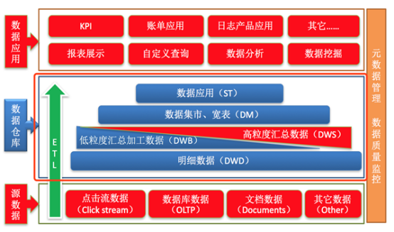
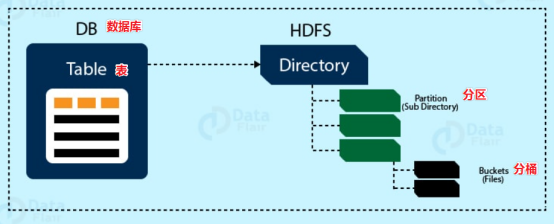
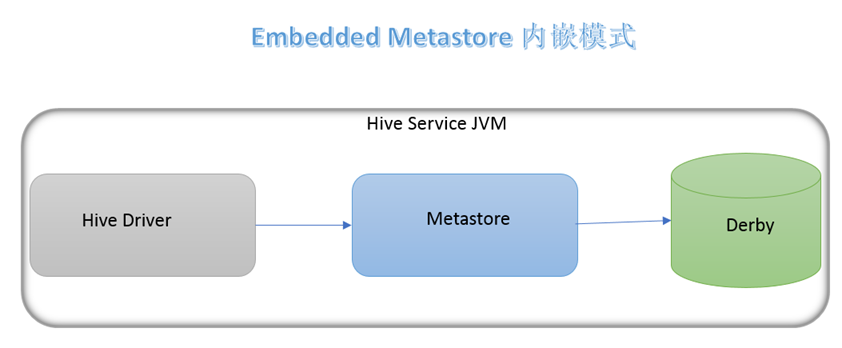
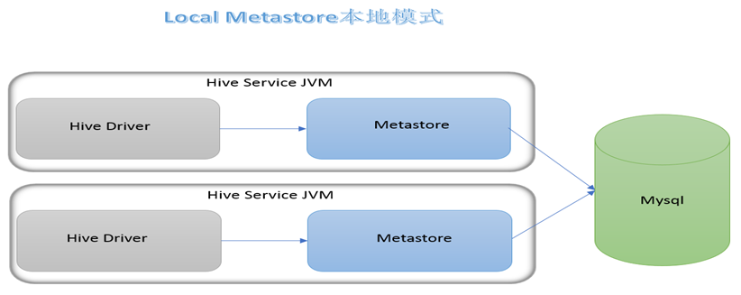
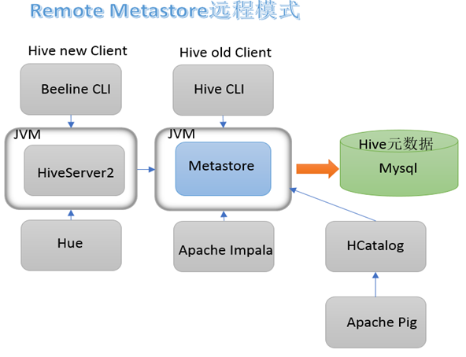
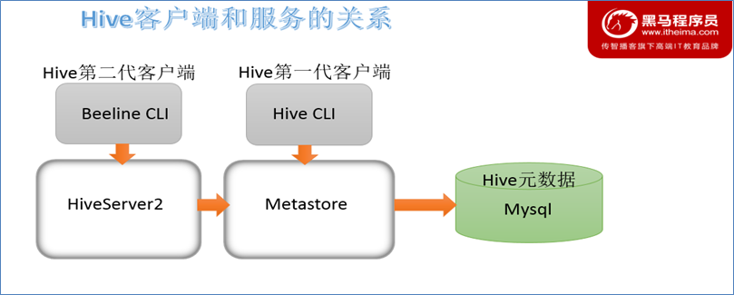

## 数据仓库

**什么是数据仓库**

数据仓库（Data Warehouse），简称 DW，数仓。目的是为了分析数据，提供决策支持的数据存放地点。

数仓本身不产生数据，不消费数据，数据从各种数据源进来，开放给各个外部组件使用。这也是为什么叫做仓库，而不叫工厂的原因。

那么为什么需要数仓而不用传统的数据库呢？因为传统的数据库首先是面向业务，同时要支持增删改查，但是数仓基本不会对数据进行更改和删除，因为数仓是为了发现规律而创造的。

**数仓分层**

数仓的特点是不生产数据，也不消费数据。

但是大量的、各种各样的数据源的数据不可能一下子加载进来就可以使用了，有可能有很多多余的字段，我们需要做的其实就是将数据精简再精简，最终剩下有用的部分。

那么为了这个目的，分层就显得尤为重要。

数仓分层每个企业都有自己不同的业务需求，可以根据这个业务需求分为不同的层次，但是最基础的分层是有三个层次：

- ODS 层：操作型数据层，这一层的数据其实就是外部数据加载进来，没有什么其他操作。
- DW 层：数据仓库层，这一层对 ODS 层中，数据多余的内容（比如字段之类）做了精简，是真正存储有用数据的地方。
- DA 层：数据应用层，这一层通常是直接使用的地方，比如使用这些数据直接生成图像、报表等。

阿里巴巴的数据分层更加细节：



注意的是 DW 层，多出了 DWD、DWB、DWS、DIM 这几层，这几层为不同的业务做了不同的数据支持。

为什么要进行分层：

- 明确的数据结构：每一个分层都有自己的作用域，在使用表的时候能够更方便地定位和理解。
- 数据血缘追踪：假如数仓的数据来源有很多，那么假如有一张来源表出了问题，我们希望能够快速定位。
- 减少重复开发：一些通用的中间数据可以减少重复计算。
- 复杂问题简单化：每一层处理单一的步骤比较容易理解。
- 屏蔽原始数据：不需要关注数据源的业务。

**ETL**

之前讲，数仓的数据来源于各个数据源，但是各个数据源的数据结构有可能不一致，所以在从数据源加载到数据仓库的过程中，我们都有：抽取数据源的数据、转换数据格式、加载到数仓。

这三步叫做 ETL，即 `抽取 Extract`、`转化 Transfer`、`加载 Load` 的过程，但其实在将数据加载到数仓中，并不一定是 ETL，也有可能是 ELT，ELTL 等，根据业务的不同做不同的处理。

## Hive 概述

**什么是 Hive**

Hive 是 Facebook 开源的一款数据仓库系统，它可以将存储在 Hadoop 的结构化、半结构化的文件进行映射，形成一张数据库表。

Hive 同时还提供类似 SQL 的查询模型，被称为 HQL（Hive 查询语言），它可以访问和分析 Hadoop 文件中的数据集，其本质是将 HQL 转换为 MapReduce 程序，减少了开发难度，让没有学习过 MapReduce 的程序员也能快速上手。


**Hive 组件**

- 用户接口：包括 `CLI（Command Line Interface，命令行）`、`JDBC/ODBC（JDBC 或 ODBC 协议）`、`WebGUI（浏览器）`。
- 元数据存储：一般来说，可以存在 MySQL 或者 Derby 中，但是大部分都会在 MySQL 中，因为 Derby 存在缺陷（下文会提到）。

    元数据，就是描述数据的数据，比如说表的名字、表的列、分区属性、所在目录等等。

- Driver 驱动程序：包括语法解析器、计划编译器、优化器、执行器。这几个程序会将 HQL 分析，转换为 MapReduce，进行优化，并将查询计划存在 HDFS 中，由执行引擎调用执行。
- 执行引擎：Hive 本身并不直接处理数据文件，而是通过执行引擎处理。当前 Hive 支持 MapReduce、Tez、Spark 三种执行引擎。

**数据模型**

Hive 的数据模型可以用来描述数据、组织数据、对数据进行操作，是现实世界数据特征的描述。类似于 RDBMS 库表结构，不过也不尽相同。

Hive 中的数据可以在粒度上分为三类：

- Table：最粗粒度，表。
- Partition：中等粒度，分区。
- Bucket：最细粒度，分桶。

其实比较好理解，Table 可以包含多个 Partition，Partition 可以包含多个 Bucket。可以对比一下阿里云 OSS，OSS 在进行对象存储时也需要分地区存储，然后创建多个 bucket。



**Databases**

Hive 的外在表现十分像一个数据库，在结构上也会分数据库（schema），默认使用的 schema 是 default。

虽然 Hive 外在像数据库，但其实数据是存储在存储系统中的。

我们以 HDFS 为例，它有一个默认的根目录，可以在 `hive-site.xml` 中查看，由 `hive.metastore.warehouse.dir` 指定，默认为 `/user/hive/warehouse`，所以 Hive 在 HDFS 中的存储路径为：`${hive.metastore.warehouse.dir}/${databaseName}.db`。

**Tables**

Hive 表和关系型数据库的表相同，Hive 中的表所对应的数据是存储在 Hadoop 的文件系统中，而表相关的元数据是存储在 RDBMS 中。

Hive 其实本质上分为两种表：内部表、外部表。两种表的区别在下文中会提到。Hive 表在 HDFS 上的存储路径为：`${hive.metastore.warehouse.dir}/${databaseName}/${tableName}`

**Partition**

其实本质来讲，分区是一种优化手段，不同分区的数据在 HDFS 上本质会存储到不同的文件夹中。

假如有一百万条会员的信息，假如我们按照年龄每 10 岁一个分区，那么假如我们想要查询 25 岁的人群就可以到对应的文件夹中查找，而不需要遍历所有文件。

Hive 分区在 HDFS 上的存储路径为：`${hive.metastore.warehouse.dir}/${databaseName}/${tableName}/${partition}`。

说明一下，最后的 partition 文件夹的命名规则是：`分区列=分区值`，比如我按照日期进行分区，那么有可能会出现一个文件夹叫做 `day=20220126`

**Bucket**

Bucket，分桶，本质上也是一种 Hive 的优化手段。

分桶在分区的规则上，可以进行更细粒度的划分，但是这次的划分不是划分成为文件夹，而是分成一个个的小文件，这样查询的数据就只需要查询指定的文件即可。

**Hive 和 MySQL**

首先讲一点，Hive 本质上不是数据库，也不能取代 MySQL。Hive 的使用场景是离线数据分析，而 MySQL 是数据的业务处理。

在 Hive 中执行数据分析，数据量是极大的，分析几小时甚至几天出结果都是很正常的，但是 MySQL 往往要求实时性。

Hive 基本不会已有数据进行增删改，但是 MySQL 是必然的。

## Hive 安装

### 安装、部署、使用

**Metastore**

在 Hive 中，存在元数据服务，也就是 Metastore，元数据我们之前提过，描述数据的数据，比如表的存放位置、表的名字等。

Metastore 服务作用是管理元数据 metastore，对外暴露地址，可以让多个客户端链接 metastore 服务间接去存取元数据，一定程度上保证了 Hive 元数据的安全。


---

**安装**

1. 首先要安装 MySQL 内容，在此之前先看一下服务器中是否含有 MySQL，有则卸载：`rpm -qa | grep -E mysql\|mariadb | xargs -n1 sudo rpm -e --nodeps`

    `rpm -qa`：查询 rpm 包。
    `mysql`、`mariadb` 都是 MySQL，不同版本而已。
    `xxx | xargs -n1`：前面的内容通过管道符作为参数，一个一个地传递给后面的命令

1. 使用 MySQL 安装包，解压 tar 包：`tar -xf mysql-5.7.28-1.el7.x86_64.rpm-bundle.tar -C /opt/software/mysql`
1. 进入到 mysql 目录中，按照如下次序依次进行安装：

    ```
    sudo rpm -ivh mysql-community-common-5.7.28-1.el7.x86_64.rpm
    sudo rpm -ivh mysql-community-libs-5.7.28-1.el7.x86_64.rpm
    sudo rpm -ivh mysql-community-libs-compat-5.7.28-1.el7.x86_64.rpm
    sudo rpm -ivh mysql-community-client-5.7.28-1.el7.x86_64.rpm
    sudo rpm -ivh mysql-community-server-5.7.28-1.el7.x86_64.rpm
    ```

1. 初始化数据库：`sudo mysqld --initialize --user=mysql`
1. 查看生成的 root 密码：`cat /var/log/mysqld.log `，其中有一行叫做 `A temprary is generated for xxxx` 的就是密码。
1. 启动 MySQL：`sudo systemctl start mysqld`
1. 登录 MySQL，修改 root 的新密码：`set password = password("新密码")`。
1. 修改 MySQL 的 root 用户为任何 ip 可连接：`update mysql.user set host='%' where user='root';`
1. 刷新：`flush privileges;`

至此，MySQL 安装完毕。

---

1. Hive 的安装比较简单，首先解压包到对应目录下。
1. 之后修改环境变量：

    ```
    # HIVE_HOME
    export HIVE_HOME=/opt/module/hive
    export PATH=$PATH:$HIVE_HOME/bin
    ```

1. Hive 和 Hadoop 的日志包冲突了，解决 jar 包冲突：`rm $HIVE_HOME/lib/log4j-slf4j-impl-2.10.0.jar`，让 Hive 去寻找 Hadoop 的 jar。
1. 拷贝 JDBC 驱动到 Hive 的 lib 下：`cp /op/software/mysql/mysql-connector-java-5.1.48.jar $HIVE_HOME/lib`
1. 配置 metastore 到 MySQL，在 $HIVE_HOME/conf 下面新建文件 `hive-site.xml`：


    ::: details 配置

    ```
    <configuration>
        <!-- jdbc连接的URL -->
        <property>
            <name>javax.jdo.option.ConnectionURL</name>
            <value>jdbc:mysql://hadoop102:3306/metastore?useSSL=false</value>
        </property>

        <!-- jdbc连接的Driver-->
        <property>
            <name>javax.jdo.option.ConnectionDriverName</name>
            <value>com.mysql.jdbc.Driver</value>
        </property>

        <!-- jdbc连接的username-->
        <property>
            <name>javax.jdo.option.ConnectionUserName</name>
            <value>root</value>
        </property>

        <!-- jdbc连接的password -->
        <property>
            <name>javax.jdo.option.ConnectionPassword</name>
            <value>123456</value>
        </property>

        <!-- Hive默认在HDFS的工作目录 -->
        <property>
            <name>hive.metastore.warehouse.dir</name>
            <value>/user/hive/warehouse</value>
        </property>
        
        <!-- Hive元数据存储的验证 -->
        <property>
            <name>hive.metastore.schema.verification</name>
            <value>false</value>
        </property>

        <!-- 元数据存储授权  -->
        <property>
            <name>hive.metastore.event.db.notification.api.auth</name>
            <value>false</value>
        </property>

        <!-- 指定存储元数据要连接的地址 -->
        <property>
            <name>hive.metastore.uris</name>
            <value>thrift://hadoop102:9083</value>
        </property>

        <!-- 指定hiveserver2连接的host -->
        <property>
            <name>hive.server2.thrift.bind.host</name>
            <value>hadoop102</value>
        </property>

        <!-- 指定hiveserver2连接的端口号 -->
        <property>
            <name>hive.server2.thrift.port</name>
            <value>10000</value>
        </property>

        <!-- 配置运行 hiveserver2 的用户登入 -->
        <property>
            <name>hive.server2.thrift.port</name>
            <value>10000</value>
        </property>

        <!-- 配置当前运行 hiveserver2 的用户有权限连接 -->
        <property>
            <name>hive.server2.enable.doAs</name>
            <value>false</value>
        </property>

        <!-- 打印表头 -->
        <property>
            <name>hive.cli.print.header</name>
            <value>true</value>
        </property>

        <!-- 打印库名称 -->
        <property>
            <name>hive.cli.print.current.db</name>
            <value>true</value>
        </property>

    </configuration>
    ```

    :::

至此，Hive 配置完成。  
  
---

### Hive 的启动

之前我们讲过元数据，那么 Hive Metadata 就是 Hive 的元数据，它包含在关系型数据库中，之后就会放到我们刚刚安装的 MySQL 中。

Metastore 即元数据服务，元数据服务的作用是管理 metadata 元数据，对外暴露服务地址，让客户端通过连接 metastore 服务连接 MySQL，进而存取元数据。

有了 metastore 服务，就可以多个客户端进行连接，这些客户端不需要知道用户名和密码，只需要连接 metastore 服务即可。某种程度上也保证了元数据的安全。
 
metastore 服务有三种模式：内嵌、本地、远程。区分三种方式主要在于两点：metastore 是否需要单独启动、metadata 是存放到内置的 derby 中还是第三方的关系型数据库（如 MySQL）。

| x                          | 内嵌模式     | 本地模式 | 远程模式 |
| -------------------------- | ------------ | -------- | -------- |
| metastore 服务是否单独配置 | 否           | 否       | 是       |
| metadata 的存储介质        | 内置的 derby | mysql    | mysql    |

那么我们之前所做的内容就是让 metastore 服务单独启动、metadata 放到 MySQL 中的，那么这就是远程模式。

---

内嵌模式下，元数据存储在内置的 derby 中，这种情况下，一次仅支持一个用户，不适合生产环境。不做讲解。



---

本地模式下，外部数据库存储元数据，但是 metastore 也不需要单独配置，比内嵌模式好些，支持多个用户，但是问题是每次启动一次 hive 服务，都内置启动一个 metastore 服务。

启动本地模式只需要使用 `bin/hive` 便可以一键启动。



---

远程模式下，metastore 需要单独启动，元数据也需要放到第三方的关系型数据库。

在远程模式下，我们也可以采用 hiveserver2 这个服务来访问 metastore，进而访问 hive 元数据，也就是在原本的 metastore 基础上再次做了一层封装，这样做的好处就是可以完全屏蔽掉数据层，带来更高的安全性和可靠性。

启动了 hiveserver2 之后，我们可以使用 beelin 来通过 JDBC 连接 hiveserver2 服务：

- 启动 metastore：`bin/hive --service metastore`
- 启动 hiveserver2：`bin/hive --service hiveserver2`
- 启动 beeline 客户端：`bin/beeline -u jdbc:hive2://hadoop102:10000 -n atguigu`

    这里注意，因为我们在配置中配置了 `hive.server2.enable.doAs`，所以这里的 `atguigu` 是你启动 hiveserver2 的用户

    并且需要注意的是，hiveserver2 并不会立刻启动，如果连接不上可能是因为服务没有启动，可以通过 `sudo netstat -anp | grep 10000` 查看 hiveserver2 是否在这个端口中启动了。




::: details 发展史

Hive 发展至今，一共经历了两代客户端工具，第一代客户都安是 `bin/hive`，他是一个 shell util，可以处理 hive 查询，也可以启动 hive 相关的服务。

到目前为止，我们一般只需要利用它来启动 hive 相关的服务。

第二代客户端是 beeline，它是一个 JDBC 客户端，性能和安全性比第一代有提高，所以我们现在一般使用这个。

:::

---

再次梳理一下 hive 几个服务和客户端之间的关系：

hiveserver2 会通过 metastore 服务读写元数据，所以启动 hiveserver2 之前需要启动 metastore 服务。

beeline 客户端通过操纵 hiveserver2 去操作 metastore，进而操作元数据。

第一代客户端 hive 会直接操作 metastore，进而操作元数据。



---

### 脚本


1. 编写脚本 `$HIVE_HOME/bin/hiveservices.sh`

    ::: details 脚本

    ```
    #!/bin/bash
    HIVE_LOG_DIR=$HIVE_HOME/logs
    if [ ! -d $HIVE_LOG_DIR ]
    then
        mkdir -p $HIVE_LOG_DIR
    fi
    #检查进程是否运行正常，参数 1 为进程名，参数 2 为进程端口
    function check_process()
    {
        pid=$(ps -ef 2>/dev/null | grep -v grep | grep -i $1 | awk '{print $2}')
        ppid=$(netstat -nltp 2>/dev/null | grep $2 | awk '{print $7}' | cut -d '/' -f 1)
        echo $pid
        [[ "$pid" =~ "$ppid" ]] && [ "$ppid" ] && return 0 || return 1
    }

    function hive_start()
    {
        metapid=$(check_process HiveMetastore 9083)
        cmd="nohup hive --service metastore >$HIVE_LOG_DIR/metastore.log 2>&1 &"
        cmd=$cmd" sleep 4; hdfs dfsadmin -safemode wait >/dev/null 2>&1"
        [ -z "$metapid" ] && eval $cmd || echo "Metastroe服务已启动"
        server2pid=$(check_process HiveServer2 10000)
        cmd="nohup hive --service hiveserver2 >$HIVE_LOG_DIR/hiveServer2.log 2>&1 &"
        [ -z "$server2pid" ] && eval $cmd || echo "HiveServer2服务已启动"
    }

    function hive_stop()
    {
        metapid=$(check_process HiveMetastore 9083)
        [ "$metapid" ] && kill $metapid || echo "Metastore服务未启动"
        server2pid=$(check_process HiveServer2 10000)
        [ "$server2pid" ] && kill $server2pid || echo "HiveServer2服务未启动"
    }

    case $1 in
    "start")
        hive_start
        ;;
    "stop")
        hive_stop
        ;;
    "restart")
        hive_stop
        sleep 2
        hive_start
        ;;
    "status")
        check_process HiveMetastore 9083 >/dev/null && echo "Metastore服务运行正常" || echo "Metastore服务运行异常"
        check_process HiveServer2 10000 >/dev/null && echo "HiveServer2服务运行正常" || echo "HiveServer2服务运行异常"
        ;;
    *)
        echo Invalid Args!
        echo 'Usage: '$(basename $0)' start|stop|restart|status'
        ;;
    esac
    ```

    :::

    shell 命令：`nohup  [命令]> file  2>&1 &`
    
    `nohup` 表示不挂起（关闭终端继续运行），`&` 代表后台运行，`2` 代表错误输出，`1` 代表标准输出，`0` 代表标准输入。`2>&1` 代表错误重定向到标准输出上。

1. 添加执行权限：`chmod u+x $HIVE_HOME/bin/hiveservices.sh`

---

### 日志

Hive 的日志默认放在 `/tmp/${user}/hive.log` 下（当前用户名下），修改日志位置到 `$HIVE_HOME/logs` 下：

1. 修改 `$HIVE_HOME/conf/hive-log4j2.properties.template` 名称为 `hive-log4j2.properties`
1. 修改配置 `property.hive.log.dir=/opt/module/apache-hive-3.1.2-bin/logs`

### 参数配置

1. 进入 hive 之后，可以使用 `set;` 查看配置信息。
1. hive 有三种配置方式：

    - 配置文件：

        - 默认配置文件：`hive-default.xml`。
        - 用户自定义配置：`hive-site.xml`，它将会覆盖默认配置文件。

    - 命令行参数：

        启动 hive 的时候，可以添加 `hiveconf param=value`，但是这种方式只会在此次 hive 会话中生效。

    - 参数声明设置：

        在 HQL（Hive SQL，之后需要学到的内容） 中，使用 `set xxx` 设置，也是对本次 hive 会话中生效。