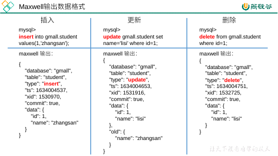

## 概述

[地址](https://maxwells-daemon.io/)，maxwell 是监控 MySQL 数据变更操作，并将变更数据以 JSON 形式发送给 Kafka、Kinesi 等流处理平台的工具。

Maxwell 的原理是基于 MySQL 的主从复制。

MySQL 的主从复制用于建立和主数据库完全相同的数据库环境，master 会将数据库变更记录记录到二进制日志文件 binary log 中，从数据库会将 binary log events 拷贝到它的中继日志 relay log 中，然后读取中继日志中的事件将最新数据结果同步到自己数据库中。

Maxwell 就是将自己伪装为从节点，并遵循 MySQL 主从复制协议，从 master 同步数据。

## Maxwell 部署

### MySQL 准备

MySQL 默认是没有开启 binary log 的，需要修改 `/etc/my.cnf`：

```
[mysqld]

# 数据库 ID
server-id = 1
#启动 binlog，该参数的值会作为 binlog 的文件名
log-bin=mysql-bin
# binlog 类型，maxwell要求为 row 类型
binlog_format=row
# 启用 binlog 的数据库，需根据实际情况作出修改
binlog-do-db=gmall
```

修改完成后需要重启 MySQL。

---

> binlog 类型，maxwell要求为 row 类型

MySQL Binlog 模式：

- Statement-based：基于语句，Binlog 会记录所有写操作的 SQL 语句，包括 insert、update、delete 等。

    优点： 节省空间
    缺点： 有可能造成数据不一致，例如insert语句中包含now()函数。

- Row-based：基于行，Binlog 会记录每次写操作后被操作行记录的变化。

    优点：保持数据的绝对一致性。
    缺点：占用较大空间。

- mixed：混合模式，默认是 Statement-based，如果 SQL 语句可能导致数据不一致，就自动切换到 Row-based。

---

之后需要创建 Maxwell 需要的数据库和用户：

- 创建数据库：`CREATE DATABASE maxwell;`。
- 调整 MySQL 密码级别：

    ```
    set global validate_password_policy=0;
    set global validate_password_length=4;
    ```

- 创建 Maxwell 用户并赋予其必要权限：

    ```
    CREATE USER 'maxwell'@'%' IDENTIFIED BY 'maxwell';
    GRANT ALL ON maxwell.* TO 'maxwell'@'%';
    GRANT SELECT, REPLICATION CLIENT, REPLICATION SLAVE ON *.* TO 'maxwell'@'%';
    ```

### Maxwell 部署

- maxwell [下载地址](https://github.com/zendesk/maxwell/releases/download/v1.29.2/maxwell-1.29.2.tar.gz)，Maxwell-1.30.0 及以上版本不再支持 JDK1.8，用 1.29。
- 解压安装包，无需配置环境变量。
- 修改配置文件：`cp config.properties.example config.properties && vim config.properties`：

    ```
    # Maxwell 数据发送目的地，可选配置有 stdout | file | kafka | kinesis | pubsub | sqs | rabbitmq | redis
    producer=kafka
    # 目标 Kafka 集群地址
    kafka.bootstrap.servers=hadoop102:9092,hadoop103:9092
    # 目标 Kafka topic，可静态配置，例如： maxwell，也可动态配置，例如：%{database}_%{table}
    kafka_topic=maxwell

    # MySQL相关配置
    host=hadoop102
    user=maxwell
    password=maxwell
    jdbc_options=useSSL=false&serverTimezone=Asia/Shanghai
    ```

## Maxwell 使用

### 脚本启停

- 启动 maxwell：`bin/maxwell --config config.properties --daemon`。
- 停止 maxwell：`ps -ef | grep maxwell | grep -v grep | grep maxwell | awk '{print $2}' | xargs kill -9`。
- 启停脚本：

    ```shell
    #!/bin/bash

    MAXWELL_HOME=/opt/module/maxwell

    status_maxwell(){
        result=`ps -ef | grep com.zendesk.maxwell.Maxwell | grep -v grep | wc -l`
        return $result
    }


    start_maxwell(){
        status_maxwell
        if [[ $? -lt 1 ]]; then
            echo "启动Maxwell"
            $MAXWELL_HOME/bin/maxwell --config $MAXWELL_HOME/config.properties --daemon
        else
            echo "Maxwell正在运行"
        fi
    }


    stop_maxwell(){
        status_maxwell
        if [[ $? -gt 0 ]]; then
            echo "停止Maxwell"
            ps -ef | grep com.zendesk.maxwell.Maxwell | grep -v grep | awk '{print $2}' | xargs kill -9
        else
            echo "Maxwell未在运行"
        fi
    }


    case $1 in
        start )
            start_maxwell
        ;;
        stop )
            stop_maxwell
        ;;
        restart )
            stop_maxwell
            start_maxwell
        ;;
    esac
    ```

### 数据输出格式




| 字段     | 解释                                                                                                     |
| -------- | -------------------------------------------------------------------------------------------------------- |
| database | 变更数据所属的数据库                                                                                     |
| table    | 表更数据所属的表                                                                                         |
| type     | 数据变更类型                                                                                             |
| ts       | 数据变更发生的时间                                                                                       |
| xid      | 事务 id                                                                                                  |
| commit   | 事务提交标志，可用于重新组装事务                                                                         |
| data     | 对于 insert 类型，表示插入的数据；对于 update 类型，标识修改之后的数据；对于 delete 类型，表示删除的数据 |
| old      | 对于 update 类型，表示修改之前的数据，只包含变更字段                                                     |


### 增量数据同步

在脚本启动之后即启动了 Maxwell，这时可以启动 Kafka 消费者，生成数据，查看输出结果。

### 历史数据全量同步

其实可以使用 DataX 进行全量数据同步。

也可以使用 maxwell 的 bootstrap 功能：`bin/maxwell-bootstrap --database gmall --table user_info --config /opt/module/maxwell/config.properties`。

采用了 bootstrap 同步的输出数据如下：

```
{
    "database": "fooDB",
    "table": "barTable",
    "type": "bootstrap-start",
    "ts": 1450557744,
    "data": {}
}
{
    "database": "fooDB",
    "table": "barTable",
    "type": "bootstrap-insert",
    "ts": 1450557744,
    "data": {
        "txt": "hello"
    }
}
{
    "database": "fooDB",
    "table": "barTable",
    "type": "bootstrap-insert",
    "ts": 1450557744,
    "data": {
        "txt": "bootstrap!"
    }
}
{
    "database": "fooDB",
    "table": "barTable",
    "type": "bootstrap-complete",
    "ts": 1450557744,
    "data": {}
}
```

- 第一条 type 为 bootstrap-start 和最后一条 type 为 bootstrap-complete 的数据，是 bootstrap 开始和结束的标志。
- 中间的 type 为 bootstrap-insert 的数据包含数据。
- 一次 bootstrap 输出的所有记录的 ts 都相同，为 bootstrap 开始的时间。
